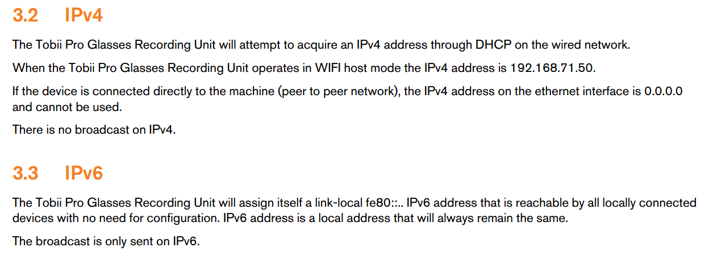
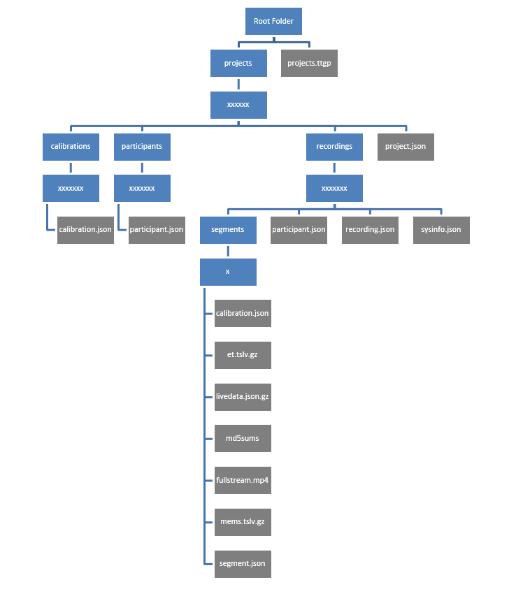
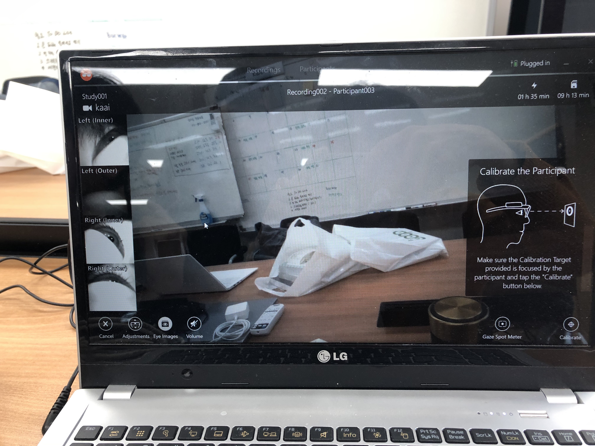

# eye-tracker-1주차

## 1. 정보 색출

### eye-tracker manual

- eye-tracker 공식 홈페이지에서 각종 설명서를 다운받아 꼼꼼히 살펴봄.

기본적인 사용법은 tobii controller 를이용한 record 및 calibration 후 실시간 영상 및 초점 스트리밍.

(-시각적으로 확인을 할 수는 있지만 데이터로 받는 것은 불가능) 

-controller는 기기가 정상적으로 연결이 되었는지 확인하는 용도로 사용

SDK 정보 

-무선연결 기능을 지원한는 모델은 IPv4연결을 지원하지만 유선연결만 가능하는 모델은 IPv4 를 지원하지 않고 자동적으로 배정받는 IPv4주소는 0.0.0.0이며 이는 사용할 수 없다.

—IPv4주소를 받기위해 공유기를 이용한 시도(유/무선)  →PC에서 ip는 정상적으로 잡히나 TCP/IP를 통한 데이터 수송신 불가능  

→SD카드에 영상 및 각종 데이터가 저장되는 디렉토리구조 

(xxxxxx로 쓰여 있는 파일은 프로그램에서 임으로 문자를 만들어 삽입) 

최종적으로 segments파일에 들어가면 시간당 초점데이터와 영상을 확인할 수 있다.

---

→ 모든 특성데이터는 json형식으로 SD카드에 저장되며 각 특성별 고유한 ID가 부여된다.

D6.1.4 Gaze Position
The gaze position is the position on the scene
camera image where the gaze will be projected.
Top left corner is (0,0), bottom right corner is
(1,1)

→ 시선데이터는 왼쪽 상단이 (0,0)이며 우측 하단이 (1,1)로 표현 되며 실시간 데이터는 이를 바탕을 로 표현되어 저장된다.

EX)

데이터에 대한 요청은 HTTP TCP/IP통신의 REST API형식으로 실행된다.

—> http://<address-of-RU>/api/<resource>

      (address-of-RU는 기기의 IP주소 / RESOURCE 는 목적에 맞게 선택적으로 작성.)

---

## 

## 2. Controller 실행

controller 실행 화면

눈의 영상과 카메라로 보이는 영상(착용자의 시야)를 확인 가능.

착용자의 초점 실시간으로 원의 형태로 확인 가능.

---

## 3. Tobii glasses python controller /Github download

[https://github.com/ddetommaso/TobiiGlassesPyController](https://github.com/ddetommaso/TobiiGlassesPyController)

github에서 tobii공식 홈페이지에서 제공하는 코드를 다운 및 수정 

********모든 코드를 실행할 때, 터미널에서 su root를 입력하여 관리자권한으로 시작 ***********

### controller.py

→ 메인 함수 실행 후 기기의 ip주소를 추적해 연결하는 코드 

TCP/IP통신을 이용하기 위해 PYTHON 상에서 socket을 이용하는 것을 확인 할 수 있다.

→ 상단의 mksock은 요청을 할때마다 실행되며 socket을 생성하는 함수 

→ 하단의 post_request는 요청 될때마다 HTTP통신을 작성하는 함수 . 

(decode('utf-8')은 python버전에 따라 선택적으로 수정 ) 

→목적별로 요청한 데이터를 받는 코드 (json 형식으로 데이터를 받는것을 확인할 수 있다.) 

### calibrae_and_record.py

→ 기기를 연결하고 calibration을 실행한 후 record를 시작하는 코드 

각 상황에 맞게 문장을 출력하며 http통신을 시도하는 것을 확인

 

실행결과 

connect함수를 이용하여 eye-tracker의 IP를 찾은 후 연결 시도하고 베터리와 SD카드의 용량을 확인후 출력하고 저장되는 정보와파일 이름 등을 출력 

Calibraion 시도 후 성공시 HTTP통신을 이용해 녹화시작 

### streaming.py

→ 기기를 연결한 후 배터리 상태와 SD카드의 용량을 체크하여 출력한뒤 잠깐의 지연 후 

실시간 데이터 출력 

#######사이의 문장을 while 루프를 이용하여 프로그램을 종료하기 전까지 무한번 실행시켜 계속해서 실시간 데이터가 출력되도록 코드 수정 

keyboardinterrupt가 실행되면 루프를 종료하여 프로그램이 종료되도록 수정 

실행결과 

→ 디바이스를 연결하 후 실시간 데이터를 출력 

## live_scene.py

기기의 IPv4 주소를 이용하여 http 통신으로 영상데이터를 요청하는 코드 

terminal에서 live_scene.py를 실행 한 결과 

address의 경우 확인 후 수정하여 입력 하여도 데이터를 받아올 수 없었음.

→ 웹에서 직접 요청한 결과

이처럼 데이터를 받아올 수 없는 것을 확인 

---

calibrate를 한다.