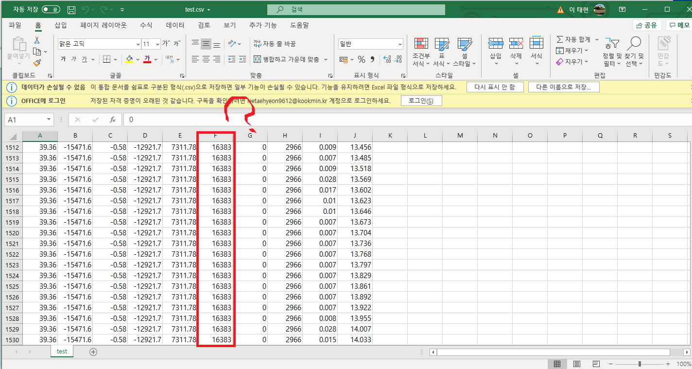
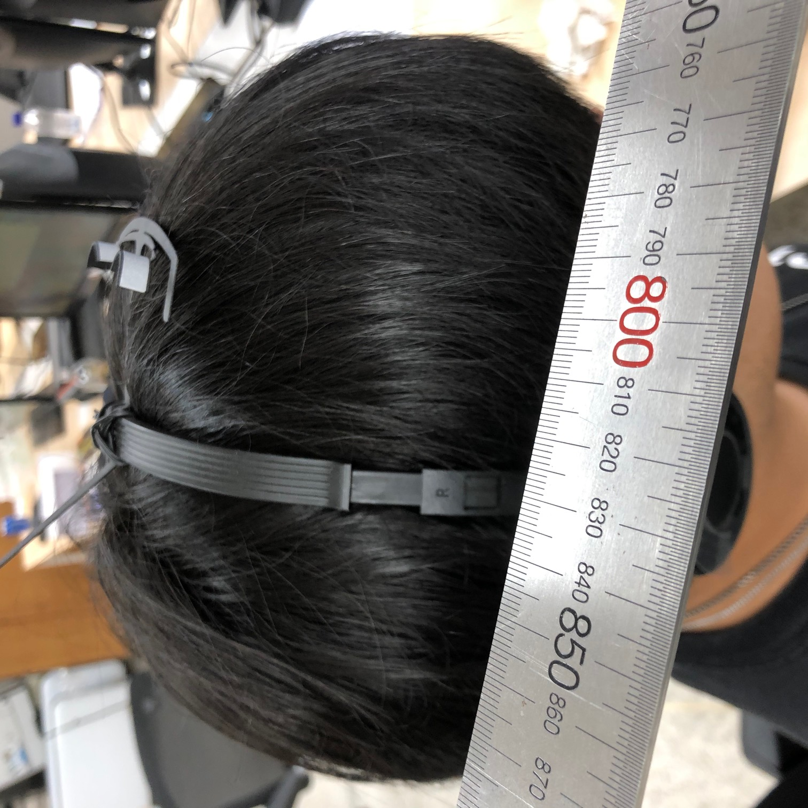
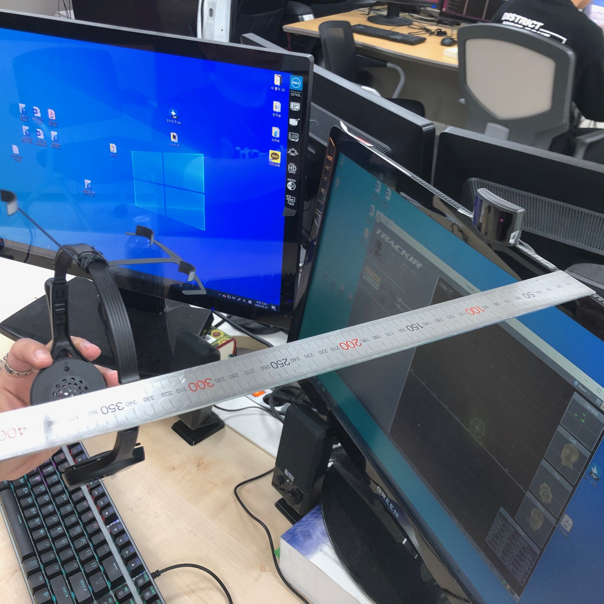
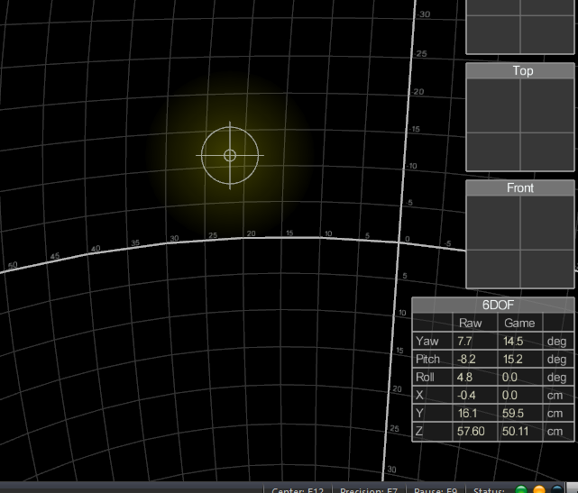

# eye-tracker-6주차

## head tracker를 사용하여 거리를 측정해 보았습니다!

### a. 먼저 track ir을 이용해보려고 했으나 프로그램에 렉이 걸려서 전에 생성한 nptest를 이용하여 거리를 측정하려고 했으나 거리가 원하는 값이 나오지 않았습니다.

### b. 하는 수 없이 track ir을 렉이 걸리더라도 다시 이용하기로 했습니다.

### 헤드트래커 본체와 측정ㅜ기를 낀 머리 사이의 거리를 측정했습니다. 약0.83m

### c. 측정기를 본체와 가까이 두고 calibration을 한 후, 거리를 측정합니다.  약 0.25m

### d. 그후 측정기를 머리에 끼고 track ir에 나오는 z축의 길이를 측정합니다.  약 0.57~0.58m

### *실제로 측정한 거리와 비슷하게 나오지만 한 가지 문제가 있습니다.

### *calibration 하는 방식이 좀 불편하다는 것입니다.

(위의 방식이 불편합니다.)

---

---

## 출력된 영상과 gp시간 동기화

실험 방법)

1. calibrate and record.py파일에 아래 코드를 추가하여 단순히 recording하는 것 뿐만 아니라 동시에 streaming을 실행시켜 gp를 얻는다. 여기서 핵심은 gp_data라는 dictionary를 임의로 만들어 이 안에 0부터 1씩 증가하는 숫자를 key로 입력하여 그 value값을 해당 프레임의 gp로 할당하게 한다.  그후 print(gp_data)로 recording중 축적된 gp를 출력하게 한다. 
2. recording이 종료된 이후에 cmd창을 반드시 닫지 않아야 한다. 왜냐하면 recording이 종료된 이후에 해당 영상과 데이터들이 저장되는 파일 이름이 출력되기 때문이다.  해당 파일안의 fullstream영상 파일을 확보하고 영상을 frame으로 분해하여 갯수를 세는 code를 실행한다.  알아낸 frame수와 cmd에 출력된 gp_data(recording 중 쌓인 gp_data dictionary로 key를 1씩 증가하는 숫자로 설정하였기에 갯수를 알 수 있다.)와 갯수를 비교분석하여 calibrate and record.py파일의 time.sleep의 변수를 조정한다.
3. 충분히 오차를 줄이면 opencv를 이용하여 video위에 해당 프레임에 맞는 gp에 원을 출력하게 한다. 

recording.py파일에 다음과 같은 코드를 작성 

→ 이전에 무작위로 출력되던 gp를 제외한 정보들을 제외하고 time.sleep을 이용하여 출력되는 시기를 일정시간 지연하여 영상이 출력되고 저장되는 동시에 그에 맞는 gp를 출력하게 설정 

결과→ 저장된 영상 frame수 =309개(영상을 frame으로 저장하는 python파일을 작성하여 이용) 

                   저장된 gp수 = 296개 (time.sleep을 0.04초로 설정한 경우)

(12.36초 영상)

추후 추가로 조정하여 갯수를 완벽히 맞출 예정 

## time.sleep(0.029)로 설정한 경우 frame의 수와 gp의 오차를 10정도로 줄임 → 시간으로 약 0.4초 정도의 오차

## 이후 open cv 를 이용하여 영상을 재생하는 동시에 그에 맞는 gp를 가져와 해당 좌표에 원을 표시

위 code는 실험방법 3번에 해당하는 부분이다.

data라는 변수에 gp_data를 복사하여 넣고 원을 그리는 코드를 작성하여 최종적으로 video위에 원을 출력하게 한다. 

try/except를 이용하여 keyerror를 방지하는 이유는 gp_data에 들어간 정보 모두가 gp라는 key를 가지고 있지는 않기 때문이다. 

이 경우 i를 한번더 증가시켜 해당 dict은 건너뛰고 다음 frame을 진행시키게 한다.

## 최종 결과

사람을 응시하는 경우

시계를 응시하는 경우

사람을 응시하는 경우

프린터를 응시하는 경우

이와같이 어느정도의 오차가 있음에도 불구하고 recording된 파일을 이용하여 시선정보를 시각화하는 것이 가능 

다음계획→ 

1. calibrate and record.py파일의 코드를 수정하여 cmd에 gp_data를 출력하는 것이 아닌 json형식으로 저장하여 복사하는 행위가 필요 없도록 수정 
2. 또한 opencv를 이용하여 원을 그리는 코드에도 gp_data를 open을 이용하여 불러와 실행하는 것으로 수정 

*수정시 경로지정에 유의 /utf-8오류를 방지하기 위해 경로 앞에 r을 붙이는 경우가 있음