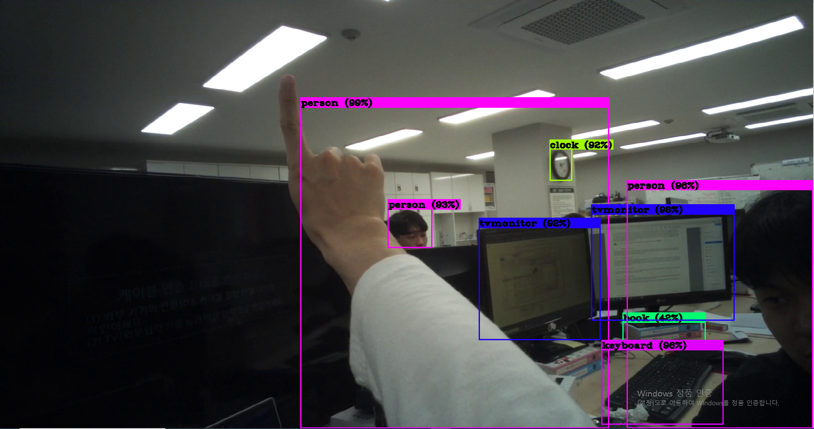

# eye-tracker-10주차

darknet 설치 후 영상이 제대로 재생되는지 확인 

darknet-master\build\darknet\darknet.sln 파일을 실행시켜 프로젝트의 속성에서 

opencv 와 cuda를 이용할 수 있도록 설정을 변경시켜준 뒤 빌드 

comand창에서 cd C:\darknet-master\darknet-master\build\darknet\x64  를 입력하여 현재 디렉토리를 변경한 후 

darknet.exe detector demo data/coco.data cfg/yolov3.cfg yolov3.weights -i 0 data/video/fullstream.mp4  ← 명령문을 입력하여 다크넷 실행 




정상적으로 실행되는 것을 확인 

우리가 얻어야 하는것은 bounding box의 좌표와 색상에 대한 정보 

따라서 코드를 분석하며 알아내야함. 

처음 명령문을 입력할 때 

darknet.exe detector demo data/coco.data cfg/yolov3.cfg yolov3.weights -i 0 data/video/fullstream.mp4

 

darknet.exe - darknet 프로젝트를 실행 

detector - detector함수 실행 (영상을 분석하기 위한 함수/ detect 는 사진을 분석하기 위한 함수)

demo  - cfg파일과 weight 파일과 재생할 영상의 경로를 인수로 받는 함수 

demo.c에서 cfg와 weight를 바탕으로 **draw_detections_cv_v3함수를 호출** 

여기서 draw_detection_cv_v3함수는 demo에서 분석한 정보를 바탕으로 인터페이스에 

bounding box를 그린다.  

// ====================================================================
extern "C" void draw_detections_cv_v3(mat_cv* mat, detection *dets, int num, float thresh, char **names, image **alphabet, int classes, int ext_output)
{
try {
cv::Mat *show_img = (cv::Mat*)mat;
int i, j;
if (!show_img) return;
static int frame_id = 0;
frame_id++;

```
    for (i = 0; i < num; ++i) {
        char labelstr[4096] = { 0 };
        int class_id = -1;
        for (j = 0; j < classes; ++j) {
            int show = strncmp(names[j], "dont_show", 9);
            if (dets[i].prob[j] > thresh && show) {
                if (class_id < 0) {
                    strcat(labelstr, names[j]);
                    class_id = j;
                    char buff[20];
                    if (dets[i].track_id) {
                        sprintf(buff, " (id: %d)", dets[i].track_id);
                        strcat(labelstr, buff);
                    }
                    sprintf(buff, " (%2.0f%%)", dets[i].prob[j] * 100);
                    strcat(labelstr, buff);
                    printf("%s: %.0f%% ", names[j], dets[i].prob[j] * 100);
                    if (dets[i].track_id) printf("(track = %d, sim = %f) ", dets[i].track_id, dets[i].sim);
                }
                else {
                    strcat(labelstr, ", ");
                    strcat(labelstr, names[j]);
                    printf(", %s: %.0f%% ", names[j], dets[i].prob[j] * 100);
                }
            }
        }
        if (class_id >= 0) {
            int width = std::max(1.0f, show_img->rows * .002f);

            //if(0){
            //width = pow(prob, 1./2.)*10+1;
            //alphabet = 0;
            //}

            //printf("%d %s: %.0f%%\\n", i, names[class_id], prob*100);
            int offset = class_id * 123457 % classes;
            float red = get_color(2, offset, classes);
            float green = get_color(1, offset, classes);
            float blue = get_color(0, offset, classes);
            float rgb[3];

            //width = prob*20+2;

            rgb[0] = red;
            rgb[1] = green;
            rgb[2] = blue;
            box b = dets[i].bbox;
            if (std::isnan(b.w) || std::isinf(b.w)) b.w = 0.5;
            if (std::isnan(b.h) || std::isinf(b.h)) b.h = 0.5;
            if (std::isnan(b.x) || std::isinf(b.x)) b.x = 0.5;
            if (std::isnan(b.y) || std::isinf(b.y)) b.y = 0.5;
            b.w = (b.w < 1) ? b.w : 1;
            b.h = (b.h < 1) ? b.h : 1;
            b.x = (b.x < 1) ? b.x : 1;
            b.y = (b.y < 1) ? b.y : 1;
            //printf("%f %f %f %f\\n", b.x, b.y, b.w, b.h);

            int left = (b.x - b.w / 2.)*show_img->cols;
            int right = (b.x + b.w / 2.)*show_img->cols;
            int top = (b.y - b.h / 2.)*show_img->rows;
            int bot = (b.y + b.h / 2.)*show_img->rows;

            if (left < 0) left = 0;
            if (right > show_img->cols - 1) right = show_img->cols - 1;
            if (top < 0) top = 0;
            if (bot > show_img->rows - 1) bot = show_img->rows - 1;

            //int b_x_center = (left + right) / 2;
            //int b_y_center = (top + bot) / 2;
            //int b_width = right - left;
            //int b_height = bot - top;
            //sprintf(labelstr, "%d x %d - w: %d, h: %d", b_x_center, b_y_center, b_width, b_height);

            float const font_size = show_img->rows / 1000.F;
            cv::Size const text_size = cv::getTextSize(labelstr, cv::FONT_HERSHEY_COMPLEX_SMALL, font_size, 1, 0);
            cv::Point pt1, pt2, pt_text, pt_text_bg1, pt_text_bg2;
            pt1.x = left;
            pt1.y = top;
            pt2.x = right;
            pt2.y = bot;
            pt_text.x = left;
            pt_text.y = top - 4;// 12;
            pt_text_bg1.x = left;
            pt_text_bg1.y = top - (3 + 18 * font_size);
            pt_text_bg2.x = right;
            if ((right - left) < text_size.width) pt_text_bg2.x = left + text_size.width;
            pt_text_bg2.y = top;
            cv::Scalar color;
            color.val[0] = red * 256;
            color.val[1] = green * 256;
            color.val[2] = blue * 256;

            // you should create directory: result_img
            //static int copied_frame_id = -1;
            //static IplImage* copy_img = NULL;
            //if (copied_frame_id != frame_id) {
            //    copied_frame_id = frame_id;
            //    if(copy_img == NULL) copy_img = cvCreateImage(cvSize(show_img->width, show_img->height), show_img->depth, show_img->nChannels);
            //    cvCopy(show_img, copy_img, 0);
            //}
            //static int img_id = 0;
            //img_id++;
            //char image_name[1024];
            //sprintf(image_name, "result_img/img_%d_%d_%d_%s.jpg", frame_id, img_id, class_id, names[class_id]);
            //CvRect rect = cvRect(pt1.x, pt1.y, pt2.x - pt1.x, pt2.y - pt1.y);
            //cvSetImageROI(copy_img, rect);
            //cvSaveImage(image_name, copy_img, 0);
            //cvResetImageROI(copy_img);

            cv::rectangle(*show_img, pt1, pt2, color, width, 8, 0);
            if (1)
                printf("\\t(left_x: %4.0f   top_y: %4.0f   width: %4.0f   height: %4.0f)\\n",
                    (float)left, (float)top, b.w * show_img->cols, b.h * show_img->rows);
            else
                printf("\\n");

            cv::rectangle(*show_img, pt_text_bg1, pt_text_bg2, color, width, 8, 0);
            cv::rectangle(*show_img, pt_text_bg1, pt_text_bg2, color, CV_FILLED, 8, 0);    // filled
            cv::Scalar black_color = CV_RGB(0, 0, 0);
            cv::putText(*show_img, labelstr, pt_text, cv::FONT_HERSHEY_COMPLEX_SMALL, font_size, black_color, 2 * font_size, CV_AA);
            // cv::FONT_HERSHEY_COMPLEX_SMALL, cv::FONT_HERSHEY_SIMPLEX
            
        }
    }
    if (ext_output) {
        fflush(stdout);
    }
}
catch (...) {
    cerr << "OpenCV exception: draw_detections_cv_v3() \\n";
}

```

}

// ----------------------------------------

rectangle 함수로 opencv 의 상자를 그린다.

따라서 rectangle의 입력인수를 이용하여 box의 좌표와 색상을 자유자재로 설정할 수 있다. 

그러나 일명 "블루베리소스.c"를 이용한다면 자신이 원하는 좌표의 bounding box만 그릴 수 있다.

일단 대략적인 블루베리소스의 코드는 이렇다.

#define MAX_LEN 100
#include <stdio.h>
#include <string.h>

void main()
{
FILE* fs;
fs = fopen("gaze_point.txt", "r");
float myint1, myint2 = 0;
while (feof(fs) == 0) {
char str[MAX_LEN];
fgets(str, MAX_LEN, fs);
sscanf(str, "%f %f", &myint1, &myint2);
printf("%f\n", myint1);	//myint1과 바운더리 박스의 x축의 좌표와 비교
printf("%f\n", myint2);	//myint2와 바운더리 박스의 y축의 좌표와 비교
}
return 0;
}

텍스트 파일에서 한줄씩 읽어와서 myint1과 myint2에 저장을 하게 된다. 

-1일 때에는 자신이 원하지 않기 때문에 우리는 if문을 사용할 때, myint1이 -1이 아닐때만 적용한다. 이렇게 해야 정확도를 높일 수 있다.  

 또한, opencv의 circle함수를 이용하여 자신의 gp데이터를 이용한 원을 그릴수 있게 된다.

원을 그리는 코드는 대략적으로 이렇다.

circle(*show_img, Point((int)myint1, (int)myint2), 20, Scalar(0, 0, 255), 7.5);

c언어를 이용한 코드기 때문에 파이썬과는 매우 다르다. 

이렇게 하여 image_opencv.cpp과 demo.c의 소스코드를 수정하였는데, 전체적인 소스코드는 이러하다. 

[demo.c](eye-tracker-10주차/demo.c)

[image_opencv.cpp](eye-tracker-10주차/image_opencv.cpp)

다음 시간에는 우리가 사용할 비디오를 프레임별로 잘라서 딥러닝 학습을 시키는 작업을 진행할 예정이다.

이거 보고 그대로 따라하기\

[https://webnautes.tistory.com/1036](https://webnautes.tistory.com/1036)

[https://www.youtube.com/watch?time_continue=325&v=VgORxv50LVY&feature=emb_title](https://www.youtube.com/watch?time_continue=325&v=VgORxv50LVY&feature=emb_title)

[https://mickael-k.tistory.com/39](https://mickael-k.tistory.com/39)(이게 진또배기-알이 꽉찼다.)