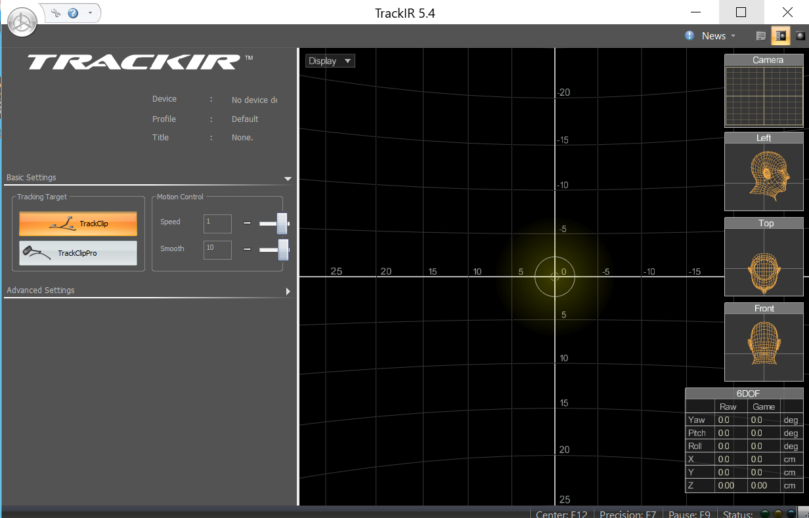
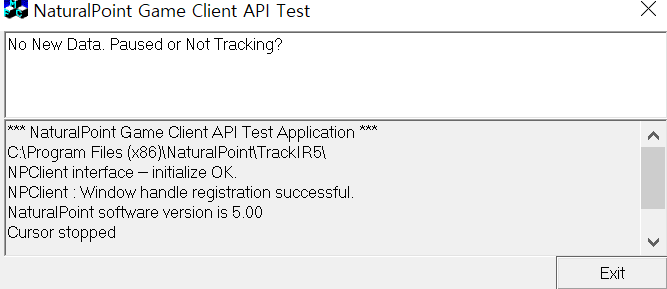
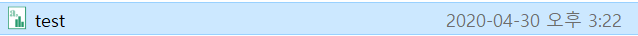
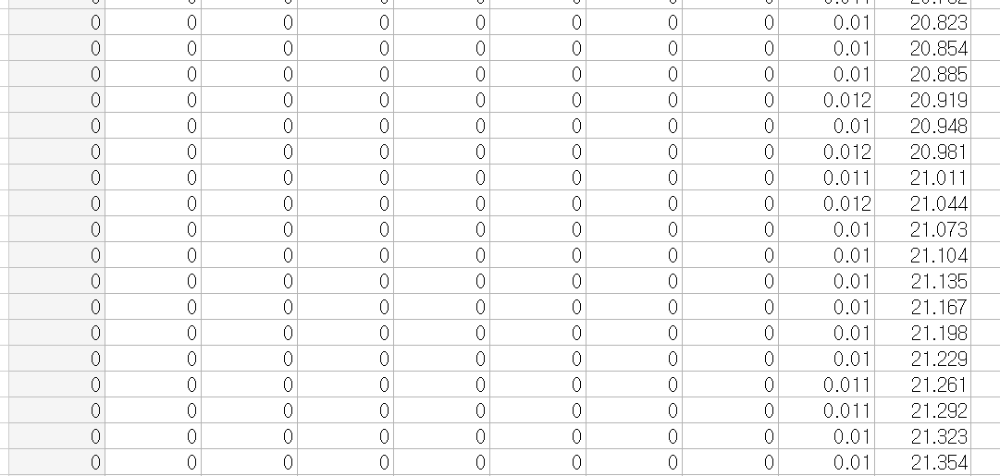
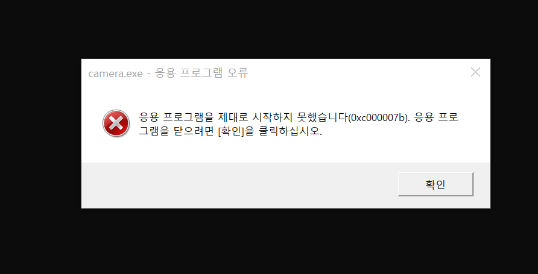
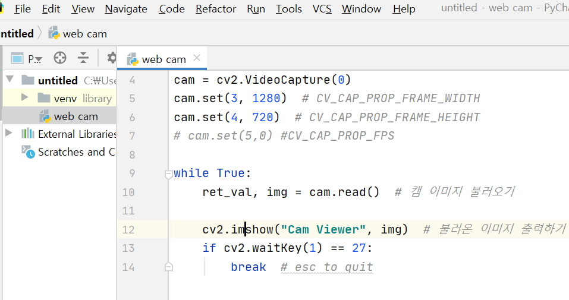
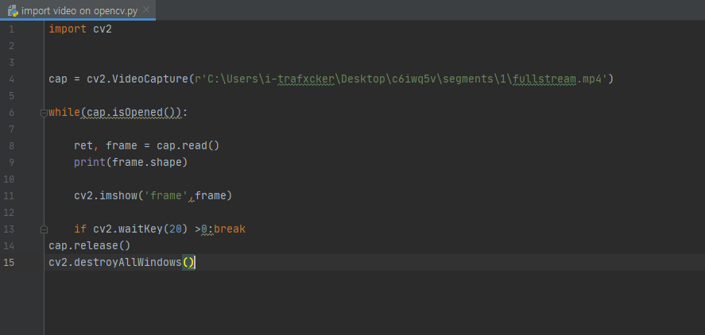

# eye-tracker-4주차

face-tracker내용

# track-ir 드라이버를 사용

지난주에 되지 않았던 드라이버가 윈도우를 공장 초기화를 한 뒤, 정상적으로 작동되었다.

그 후,  track-ir sdk를 이용하여 'nptest'라는 데이터 추출 응용 프로그램을 만들고, track-ir드라이버와 sdk를 실행하여, 데이터를 추출했다.  

정상적으로 작동하는 모습

# test파일 생성

이렇게 test파일이 생긴다

파일 안을 들여다 본 모습...

장치를 키지 않아서 값이 전부 0이다.

이전에 장치를 키고 측정했을때, 정상적인 값이 나온다.

앞에서 부터 pitch   yaw   roll   x   y   z   state   frame   t/1f   time의 값이다.

# 문제 발생...

하지만, 문제가 발생한다...이전에는 잘 되었던 웹캠을 키는 카메라의 응용 프로그램이 켜지지 않는다...

그래서 파이참을 이용하여, 파이썬을 이용하여 웹캠을 이용하는 프로그램을 작성 중!

아직, 개발이 완성되지 않은 상태이다

---

---

---

---

---

---

# 딥러닝을 위한 eye tracker 자료 이용

## 목표: eye-tracker장비로 기록한 데이터를 이용하여 영상과 초점 동시출력

## 차후계획: Object detection을 이용한 초점에대한 물체 detection

### 1. 데이터 가져오기 및 편집

-아이트래커장비를 이용하여 녹화를 한 다음, 해당 데이터를 컴퓨터로 이동 

이용할 데이터: fullstream  , live data

-fullstream.mp4

opencv를 이용하여 영상을 재생 

컴퓨터에서 영상을 불러옴 

결과 

-live data.json

*기존에 json파일은 이용할 수 없었음 (모든 데이터가 하나의 key로 묶여있어야하며 모든 데이터 사이에는 , (comma)가 있어야 함) 

이는 따로 편집을 해줘야 함 

기존의 이용할 수 없었던 json파일을 편집하는 코드

편집 전 json 형식

편집 후 json 형식

나머지 처리를 해준후 json파일

이렇게 json파일을 이용할 수 있는 형태로 편집 한 후 이용하기 위한 코드를 만든다.

json파일을 불러와 gp(gaze point)만 출력하는 코드 

결과 

## 가져온 영상파일과 편집한 json파일을 이용하여 영상에서 원으로 표시하는 코드 (미완성)

### *live data와 fullstream 의 time 동기화

fullstream shape = 1080,1920 / 25fps

live data = micro/sec 단위로 ts가 기록됨 

1. python timer를 이용하려 하였으나 최소 시간단위가 1초이므로 이는 너무 늦은 응답속도다.(이용불가)
2. 해당프레임의 시간을 찾아 gp를 선택적으로 이용해야 할 것 같다 .