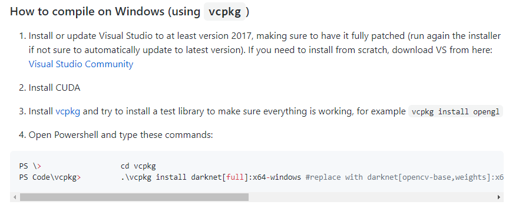

# eye-tracker-9주차

github에서 [https://github.com/AlexeyAB/darknet#how-to-compile-on-windows-using-cmake](https://github.com/AlexeyAB/darknet#how-to-compile-on-windows-using-cmake)에서 

vcpkg를 설치하던 도중 이런 오류가 발생했다.

따라서 visual studio의 도구-도구 및 기능 가져오기- 언어팩- 영어 설치

현재 의문인 부분

