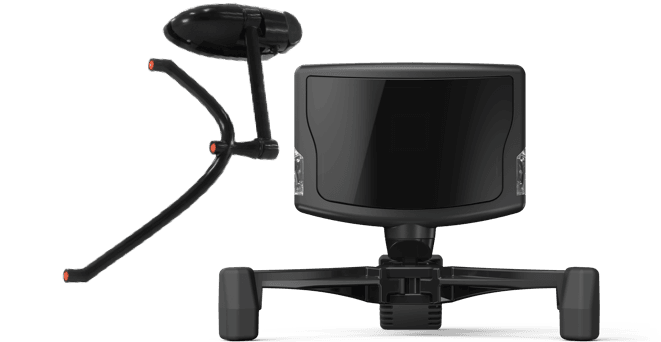

# 캡스톤 디자인 최종보고서-EYE TRACKER

[1. Tobii pro glasses 2 ](최종보고서-EYE_TRACKER/1_Tobii_pro_glasses_2.md)

[2. Head Tracker](최종보고서-EYE_TRACKER/2_Head_Tracker.md)

[3. YOLO Darknet Custimizing](최종보고서-EYE_TRACKER/3_YOLO_Darknet_Custimizing.md)

[4. ARUCO Marker](최종보고서-EYE_TRACKER/4_ARUCO_Marker.md)

---

---

---

# 1.  tobii eyetracker



Head Unit


Recording Unit 

- 설명에 앞서 이 보고서에서 위 두 그림의 첫번째 그림의 장치를 Head Unit이라 칭하고 두번째 그림의 장치를 Recording Unit이라 칭한다.

## 1) User Manual

1-1) 위 장치를 사용하기위해서 먼저 Head Unit의 5번단자와 Recording Unit의 6번 단자에 하나의 선을 연결 해준다. 

1-2) Recording Unit의 이더넷 단자와 노트북이나 컴퓨터의 이더넷단자를 연결해 준다. 

1-3)  Recording Unit의 측면에 SD카드가 잘 삽입되어있는지 확인하고 전원버튼 (터치형) 을 길게 눌러 전원을 켜준다. 

1-4) 전원 표시등에 불이 들어와 있으면 전원이 켜져 컴퓨터와 연결된 상태를 의미하므로 이는 성공적인 연결을 의미한다. 
1-5) 이 후 연결된 컴퓨터에서 프로그램을 실행시켜 시선추적기를 작동시킨다. 

[https://www.tobiipro.com/ko/product-listing/tobii-pro-glasses-2/](https://www.tobiipro.com/ko/product-listing/tobii-pro-glasses-2/)  → tobii pro 홈페이지 

위 링크를 통해 tobii pro glasses Controller 를 다운받아 연결이 잘 되었고 작동이 정상적으로 되는지 확인해보길 바란다. 


Controller 를 실행한 모습 

## 2) Eye tracker data

2-1) 시선추적기를 통해 녹화된 정면 video와 gaze point는 다음과 같은 파일 구조로 SD카드에 저장되게 된다.

XXXXX = 무작위 파일명 


2-2)측정된 gaze point는 json형태로 저장되게 된다. (파이썬의 dictionary와 비슷하다고 생각하면 됨)


# live data.json 의 저장된 형식

아래 데이터는 json형식으로 저장된 몇가지 예시들이다. 

{"ts":3170668458,"s":0,"ac":[-0.471,-9.598,2.251]}

{"ts":3170569152,"s":0,"gy":[11.620,-13.868,-1.166]}

{"ts":3170660907,"s":0,"gidx":52598,"pc":[-31.86,-23.72,-26.34],"eye":"right"}

{"ts":3170660907,"s":0,"gidx":52598,"pd":4.02,"eye":"right"}

{"ts":3170660907,"s":0,"gidx":52598,"gd":[0.0352,0.3276,0.9442],"eye":"right"}

{"ts":3170680864,"s":0,"gidx":52599,"pc":[28.52,-23.18,-28.38],"eye":"left"}

{"ts":3170680864,"s":0,"gidx":52599,"pd":4.04,"eye":"left"}

{"ts":3170680864,"s":0,"gidx":52599,"gd":[-0.0630,0.2838,0.9568],"eye":"left"}

{"ts":3170660907,"s":0,"gidx":52598,"l":119702,"gp":[0.5377,0.2307]}

{"ts":3170660907,"s":0,"gidx":52598,"gp3":[-6.66,159.54,533.55]}

ts - time stamp

연속적으로 데이터를 저장할 때 시간을 표시

s - status

데이터의 status를 나타내며 0일 경우 정상,그 외의 숫자일 경우 비정상

ac-accelerometer

안경의 회전가속도를 표시. 가속도계 데이터의 초당 미터 제곱은

[m / s²]. 안경의 움직임이 없을 때 ac 속성 값은 대략 [0, -9,82, 0]입니다.

gy - Gyroscope

안경의 회전데이터 , 초당 단위 각도 [° / s]

pc - Pupil Center

속성 pc는 scenecam에서 3D 좌표로 지정 . 눈 위치를 비교하는 데 사용

좌표는 mm.

pd - pupil diameter

동공 직경은 mm 단위로 측정되며 각 눈에 대해 별도로 전송

gd - Gaze Direction

시선 방향은 각막 위치 (또는 가능하면 동공 중심)의 단일 백터.

gp - gaze point

장면의 위치

시선이 투사 될 카메라 이미지

왼쪽 상단은 (0,0)이고 오른쪽 하단은

(1,1)

gp3 - gaze point 3d

GazePosition3d는 시선이 집중된 장면 카메라를 기준으로 한 3D 위치 (mm).


## 3) 실행 프로그램 - calibrate_and_record.py

[https://github.com/ddetommaso/TobiiGlassesPyController](https://github.com/ddetommaso/TobiiGlassesPyController)  → 시선추적기 관련 코드 github

먼저 위 링크를 통해 모든 코드를 다운받는다. 

모든코드를 한번쯤 훝어보길 바란다.

아래코드는 calibrate_and_record.py 와 streamin.py파일을 합성한 것으로 그 이유는 다음과 같다. 

1) 저장된 json파일 형식의 gp(gaze point)는 이용하기에 번거롭다. 따라서 녹화가 시작되고 끝나는 동시에 txt파일로 저장하여 입출력이 쉽게 편집 (csv로도 가능 ) 
2) 영상의 frame속도와 gp가 저장되는 time stamp속도가 다르기 때문에 sync의 한 방법으로 대체 가능 (핵심)

```jsx
# calibrate_and_record.py : A demo code for calibrating and recording
#
# Copyright (C) 2019  Davide De Tommaso
#
#   This program is free software: you can redistribute it and/or modify
#   it under the terms of the GNU General Public License as published by
#   the Free Software Foundation, either version 3 of the License, or
#   (at your option) any later version
#
#   This program is distributed in the hope that it will be useful,
#   but WITHOUT ANY WARRANTY; without even the implied warranty of
#   MERCHANTABILITY or FITNESS FOR A PARTICULAR PURPOSE.  See the
#   GNU General Public License for more details.
#
#   You should have received a copy of the GNU General Public License
#   along with this program.  If not, see <https://www.gnu.org/licenses/>

import time
from tobiiglassesctrl.controller import TobiiGlassesController

if hasattr(__builtins__, 'raw_input'):
      input=raw_input

def main():
        f=open("C:\Users\LG\Desktop\gaze_point.txt","w")//파일 저장 위치 
            
	tobiiglasses = TobiiGlassesController()
	print(tobiiglasses.get_battery_info())
	print(tobiiglasses.get_storage_info())

	if tobiiglasses.is_recording():
		rec_id = tobiiglasses.get_current_recording_id()
		tobiiglasses.stop_recording(rec_id)

	project_name = input("Please insert the project's name: ")
	project_id = tobiiglasses.create_project(project_name)

	participant_name = input("Please insert the participant's name: ")
	participant_id = tobiiglasses.create_participant(project_id, participant_name)

	calibration_id = tobiiglasses.create_calibration(project_id, participant_id)
	input("Put the calibration marker in front of the user, then press enter to calibrate")
	tobiiglasses.start_calibration(calibration_id)

	res = tobiiglasses.wait_until_calibration_is_done(calibration_id)

	if res is False:
		print("Calibration failed!")
		exit(1)

	recording_id = tobiiglasses.create_recording(participant_id)
	print("Important! The recording will be stored in the SD folder projects/%s/recordings/%s" % (project_id, recording_id))
	input("Press enter to start recording")
	tobiiglasses.start_recording(recording_id)
	tobiiglasses.send_custom_event("start_recording", "Start of the recording ")
//calirate의 성공 이후 recording 시작 
	#-------------------------------------------------------------------------------------------------------------------------
	
	
	tobiiglasses.start_streaming()// recording 시작후 즉시 streaming을 이용해 gp_data 추출
	while True:
              
              try:
                   time.sleep(0.033)// 영상의 frame속도와 time stamp속도가 어느정도 일치하게 하는  지연 시간 
                   gp_data=str(tobiiglasses.get_data()["gp"])
                   if "-1" in gp_data:
                         pass//-1은 의미없는 값이기 때문 
                   else://json형식에서 gp데이터만을 추출하여 저장하는 과정 
                         index1=gp_data.find("[")
                         index2=gp_data.find("]")
                         gp_data=gp_data[index1+1:index2]
                         gp_data=gp_data.replace(",","")
                         gp_data=gp_data.replace("\n","")

                   f.write(gp_data)
                   f.write("\n")
                  
                   
              except(KeyboardInterrupt)://while문 탈출 조건을 KeyboardInterrupt로 하여 
		   break                            //그 전까지 계속하여 저장함 
#--------------------------------------------------------------------------------------------------------
        
        
	tobiiglasses.send_custom_event("stop_recording", "Stop of the recording " + str(recording_id))
	tobiiglasses.stop_recording(recording_id)
        
//recording 종료
	if res is False:
		print("Recording failed!")
		exit(1)

if __name__ == '__main__':
    main()
```

위 코드는 녹화시에 사용한 코드이다. 자세한 설명은 코드에 주석으로 달아놨으며 단순한 구조이다.

위 코드를 이용하여 녹화를 마치면 우리에게 두가지 데이터가 있다. 
1. livestream → 전방카메라 녹화영상 
2. gaze_point.txt → gp데이터 

두 데이터는 이미 녹화과정에서 sync를 마친 데이터라고 볼 수 있다.

따라서 이후에 이 두데이터를 적절히 활용하여 적용한다. 

# 2. Head Tracker

## 정의

 TrackIR 은 게임자 머리의 위치와 방향을 찾고 그 데이터를 어떠한 프로그램이나 시뮬레이션으로도 보낼 수 있다 . 따라서 3차원 공간에서 실제 머리의 움직임으로 여러분의 게임 화면을 제어할 수 있다 .

## 현재 사용하고 있는 헤드 트래커와 기본 구성

 Natural Point사의 TrackIR5를 현재 사용하고 있다.


a. TrackClip PRO는 카메라에 적외선을 직접 보내는 액티브 LED 마커가 포함되어 있다

b. 두 개의 트랙 클립 중 하나를 사용하여 머리의 위치를 추적하는 적외선 카메라다 .

## 사용하는 소프트웨어

a. 기본적으로 제공되는 Natural Point사에서 제공되는 소프트웨어

[TrackIR_5.4.2.exe](https://s3.amazonaws.com/naturalpoint/trackir/software/TrackIR_5.4.2.exe)


특징: 사용법이 매우 간단한 반면에 소프트웨어 화면상의 데이터를 전송하거나 사용할 수 없는 것이 특징! 현재 헤드트래커가 정상적으로 작동하는지 확인하는데에만 사용하면 된다!

b. Natural Point사에서 제공하는 개발자 전용 소프트웨어

[head_tracker사용.zip](최종보고서-EYE_TRACKER/head_tracker.zip)


특징: 압축파일을 다운받아 압축을 해제하면 NPTEST의 솔루션 파일이 있다. 이것을 통해 자신이 원하는 대로 NPTEST의 코드수정을 통하여 빌드를 하면 된다. data생성 폴더에 들어가면 이미 nptest를 빌드한 폴더 또한 존재한다. 하지만, nptest는 exe로 빌드되기 때문에 window환경에만 유효하다. *ubuntu환경에서는 사용이 불가능하다.

c. Linux Tracker

[https://github.com/GNOME/tracker](https://github.com/GNOME/tracker)


특징: ros를 사용하여 데이터를 하나로 집약시켜, 실질적으로 사용하려면 linux tracker를 사용해야 한다. 위의 github링크의 wiki부분을 들어가면 설치방법이 있다. 여기서 순차적으로 시키는대로하면 linux tracker가 설치된다. 이후, lidar, camera, can, eye tracker와 같이 다양한 센서와 실시간으로 데이터를 주고 받으며 통신하면 된다.

*주의! 프로그램이 굉장히 불안정하기 때문에 설치 도중이나 설치완료 이후 ubuntu가 통채로 날아갈 수 있으니 주의할 것!

# 3. YOLO Darknet Cumstomizing

- yolo darknet을 실행하기에 앞서 환경설정이 중요하다.

## 1)yolo darknet을 이용하기 위해서 필요한 것들

1. 그래픽 드라이버( 포멧하지 않는 이상 이미 설치되어 있음 , 포멧한다면 가장 먼저 설치해야 하는 것) 
2. visual studio 
3. cuda (그래픽 카드에 따라 적절한 버전 선택 )
4. cudnn (cuda 버전에 따라 적절한 버전 선택 ) 
5. openCV 
6. yolo 

 - 위 리스트는 설치 순서와는 무관하다.  

 - 위 항목들을 설치하는데 google을 참조하는 것이 좋다. 

## 2) yolo darknet customize

 

- 이번 항목은 darknet을 이용하여 나만의 weights파일을 만드는 항목이다. 
이번 항목을 수행하기에 앞서 기본적으로 livestream을 input으로 yolo를 실행하보아도 좋다.

---

handle ,side_side_mirror ,right_side_handle ,room_mirror ,center_fascia ,car ,instrument_panel

위 7개 항목을 인식하는 yolo 가중치파일을 만들야 한다. 

시뮬레이터에서 영상을 녹화한 후 (실내는 실제, 실외는 모니터상의 ucwin) yolo marker를 이용하여 가중치 파일을 만든다. 

영상을 프레임별로 분리한 후 yolo marker에 적용 

---

★ ffmpeg 사용법 (cmd 창에서)

1. 동영상이 있는 경로로 이동(해당 경로에 frame이 저장되므로 폴더에 넣어놓은 후 실행 할 것을 추천 ) 

2. 명령어 입력

1) ffmpeg -i [ 동영상 제목.확장자 ] -vf fps=[ 1초당 x 프레임으로 잘라져서 저장됨 ] [ 저장되는 번호의 순서 or 이름 설정 ]%d.jpg 

2) ffmpeg -i [ Inner_pocket1.mp4 ] -vf fps=[ 31 ] [ 0 ]%d.jpg

3) ffmpeg -i Inner_pocket1.mp4 -vf fps=31 0%d.jpg ( 최종 코드 예시 )


---

### yolo mark 다운 & Labeling

[AlexeyAB/Yolo_mark](https://github.com/AlexeyAB/Yolo_mark)

위 링크에서 yolo mark를 다운받는다. 

1. 압축을 풀고 yolo_mark.sln 을 실행한다. 
2. 1)프로젝트 속성에서 c/c++ - 일반 - 추가포함 디렉터리에 C:\opencv\build\include를 추가 
    
    2)링커-일반-추가 라이브러리 디렉터리에 C:\opencv\build\x64\vc14\lib를 추가
    
3. F5를 눌러 빌드. 
4. x64 - Release - data 에서 
    
    1) obj.data파일에서 classes 를 자신이 원하는 classes갯수로 수정한다.  
    
    2) [obj.name](http://obj.name)s 에서 classes의 갯수대로 이름을 입력한다. 
    
    3)train.txt 파일의 모든 내용을 지운다.
    
5.  img폴더에 jpg데이터를 넣는다.(jpg만 호환!!!!!!!!)
6. 이후에 yolo_mark.cmd를 클릭하여 YOLO Mark 실행
7. 이후에 수많은 사진을 열심히 boxxing한다. 
8. boxxing을 마치면 obj.data , obj.names , train.txt ,img폴더를

darknet-master\build\darknet\x64\data 에 옮긴다. 

 9. cfg폴더의 yolov3.cfg파일을 복사하여 x64로 옮긴후 

    yolo-obj.cfg로 이름을 변경한 후 열어서  Line 610,696,783 의 classes를 수정해주고 

                                                                      Line 603, 689, 776의 filters =(N+5)*3으로 수정 (N은 classes)

10. 미리 학습된 weights를 다운받는다. ([https://pjreddie.com/media/files/darknet53.conv.74](https://pjreddie.com/media/files/darknet53.conv.74))

11. 파일을 x64로 옮긴후 

darknet.exe detector train data/obj.data yolo-obj.cfg darknet53.conv.74 입력 

12. 학습하는 횟수는 cfg의 max_batches의 값을 변경하여 조절할 수  있다. 

13. backup폴더에 저장된 weights파일을 이용하여 

darknet.exe detector test data/obj.data yolo-obj.cfg yolo-obj_last.weights  를 입력 하여 test진행 

### 수많은 사진을 boxing하기 전 컴퓨터에서 학습이 잘 진행되는지 qr코드를 이용하여 학습한 내용


위와 같은 설명을 통해 자신만의 필요한 weights파일을 만들어 프로젝트에 적용한다. 

3000장 정도의 사진을 boxing하고 약 2700번정도 학습시켰을 경우 
loss는 2.3에서 내려가질 않아서 중단 

그 결과:


성공적으로 실행됨을 확인할 수 있다. 

# 4. ARUCO Marker

## marker의 필요성


모니터의 모서리에 aruco marker가 부착된 사진

결론부터 말하자면 marker가 있어야 원하는 데이터를 갖고 올 수 있다.

eye tracker를 사용하여 1920*1080 동영상을 생성한다면 1920*1080개의 좌표 있을 것이다. 

우리는 이곳에서 하나의 시선좌표(gaze point)를 받아온다.  

우리가 eye tracker를 사용하는 최종적인 목표는 자신이 바라보는 물체가 무엇인지 알아내는 것인데 marker가 있어야 모니터상의 원하는 데이터만 가져올 수 있다.

## Aruco Marker 설치 방법( opencv_contrib )

*일반적인 opencv를 통해서는 aruco marker를 사용할 수 없다. extra module이 있는 opencv_contrib를 사용해야 aruco marker를 사용할 수 있다.

**OpenCV Extra Modules**

OpenCV에서 새로운 API가 추가되는 경우 안정성이나 성능이 검증되지 않은 경우 공식 배포를 하지 않고, Extra Modules(opencv_contrib)에 포함시키게 된다. 내가 써보고싶었던 Slic algorithm도 여기에 포함되어있다.

**설치환경 : Visual Studio 2013, Windows 32bit**

64bit 환경에서의 설치는 아래 링크를 참고하기를 바란다. 꽤 자세히 나와있다.

[https://putuyuwono.wordpress.com/2015/04/23/building-and-installing-opencv-3-0-on-windows-7-64-bit/](https://putuyuwono.wordpress.com/2015/04/23/building-and-installing-opencv-3-0-on-windows-7-64-bit/)

**1. CMAKE 3.7.0 다운로드**

**[https://cmake.org/download/](https://cmake.org/download/)**

나는 Windows win32-x86 ZIP 를 다운 받았고 압축을 풀어주었다.

**2. OpenCV 3.0 or 3.1 다운로드**

**[http://opencv.org/downloads.html](http://opencv.org/downloads.html)**

나는 이미 3.0 버전이 깔려있었다.

**3. OpenCV contrib**

**[https://github.com/opencv/opencv_contrib](https://github.com/opencv/opencv_contrib)**

여기서 Clone or download 초록 버튼을 눌러 zip 파일로 다운한 뒤 C드라이브에 압축을 풀어주었다. 이 페이지에 OpenCV's extra modules 에 대한 전반적인 내용이 담겨있다. 이를 보고 따라해도 되지만 더 설명이 필요한 것 같아서 포스팅해본다.

**1. CMAKE 설정**

설치하였던 **cmake 폴더 - bin 폴더 - cmake-gui.exe 파일을 실행**

**Where is the source code - C:\opencv\sources**

이 부분에 기존에 설치하였던 opencv 3.0 의 sources 경로를 입력해주었다. 새로 OpenCV를 설치하였다면 그 폴더의 sources 폴더의 경로를 입력해주면 된다.

**Where to build the binaries - C:\opencv_extra_build**

이 부분은 C 드라이브에 **"opencv_extra_build"** 라는 폴더를 새로이 생성해주고, 경로를 입력했다.

경로를 모두 다 입력한 뒤 **"Configure"** 를 누른다.

그러면 창 하나가 뜨는데 자신의 비주얼 버전에 맞게 입력해주고 **(Visual Studio 12 2013)**

**Use default native compliers 에 체크**해주고 Finish를 누른다.

그러면 아래와 같이 빨갛게 변하면서 맨 아래 창에 Configureing done 이라는 메세지가 뜬다.

[https://t1.daumcdn.net/cfile/tistory/2454DE4D5829A37E06](https://t1.daumcdn.net/cfile/tistory/2454DE4D5829A37E06)

이 과정이 끝나면 **opencv_contrib/modules/bioinspired  라는 폴더를 삭제**해준다. 삭제하지 않고, 비주얼 프로젝트를 생성하고 빌드하게 되면 에러메세지가 나타난다고 한다.

그 다음 빨갛게 표시된 부분에서 **"OPENCV_EXTRA_MODULES_PATH"에서 다운받았던 opencv_contrib-master의 modules 디렉토리로 지정**한다.

라고 많은 블로그들과 git에 나와있었는데 나는 계속 Call Stack (most recent call first) 빨간줄 에러가 떠서 **opencv_contrib-master 까지의 경로만 입력해주었더니 Configure에 성공**하였다.

경로를 입력해주고, 필요한 파일을 체크하고 필요없는 파일을 체크 해제 해준다.

OpenCV 카페에서 찾아본 내용에 의하면 **opencv world, contrib world는 체크하게 된다면 일부 파일에서 링크오류가 나기 때문에 가급적이면 체크를 해제한 상태로 두는게 낫다**고 한다.

[http://cafe.naver.com/opencv/11896](http://cafe.naver.com/opencv/11896) (이 글 참조)

**경로 입력해준 뒤 필요없는 파일을 체크하고 Configure 버튼을 누르게 되면,**

**아래와 같이 맨 및 창에 Configuring done 이라는 메세지가 뜬다.**

[https://t1.daumcdn.net/cfile/tistory/27588F4D5829A37E02](https://t1.daumcdn.net/cfile/tistory/27588F4D5829A37E02)

그 다음 Generate 버튼을 눌러주면 아래와 같이 뜬다. 그럼 이제 Cmake 설정은 끝이 났다.

[https://t1.daumcdn.net/cfile/tistory/2349974D5829A37F13](https://t1.daumcdn.net/cfile/tistory/2349974D5829A37F13)

**2. Visual Studio 설정**

[https://t1.daumcdn.net/cfile/tistory/2476A0415829A9B905](https://t1.daumcdn.net/cfile/tistory/2476A0415829A9B905)

CMAKE 설정이 완료되면, 아까 새로 생성했던 **opencv_extra_build 폴더에서 "OpenCV" 프로젝트 파일을 열어준다.** 그 다음 **CMakeTargets 이라는 폴더의 INSTALL 파일을 우클릭하고, build** 를 눌러준다. 나는 Debug 모드로 실행하였고, 빌드에 실패할 경우 실패된 파일은 쓸 수 없다.

그러면 조금 시간이 걸리긴 하지만 build가 되기 시작한다.

[https://t1.daumcdn.net/cfile/tistory/2421F1445829A9CA1A](https://t1.daumcdn.net/cfile/tistory/2421F1445829A9CA1A)

**아래와 같이 빌드에 모두 성공하게 되었다.**

[https://t1.daumcdn.net/cfile/tistory/25132E465829AAC803](https://t1.daumcdn.net/cfile/tistory/25132E465829AAC803)

**3. 환경변수 설정 및 프로젝트 속성 설정**

**3-1. 환경변수 설정**

**시스템 속성 - 고급 시스템 설정 - 환경변수 - 시스템 변수 - Path 편집**

자신이 만든 opencv_extra_build 폴더의 bin 폴더를 추가해준다.

C:\opencv_extra_build\install\x86\vc12\bin; 추가

**3-2. 비주얼 스튜디오 프로젝트 속성 설정**

1. 프로젝트 속성 - C / C++ - 추가 포함 디렉터리 - include

C:\opencv_extra_build\install\include

2. 링커 - 입력 - 추가 종속성 라이브러리 추가

C:\opencv_extra_build\install\x86\vc12\lib

편하게 lib 복사하는 법은 해당 폴더에 list.txt 파일을 만들고 dir /b /oe > list.txt 를 입력하고 저장한다. 그리고 list.txt -> list.bat 파일로 변경하고 실행한다. 그러면 list에 해당 폴더에 있는 내용들이 메모장에 출력되는 것을 확인할 수 있단다. 그런데 나는 이것 마저 어렵게 느껴져서 그냥 하나씩 다 입력했다...ㅋㅋ

debug 모드에선 마지막에 d를 붙이고, Release 모드에선 d를 빼고 입력해준다.

```jsx
opencv_calib3d300d.lib
```

```jsx
opencv_core300d.lib
```

```jsx
opencv_features2d300d.lib
```

```jsx
opencv_flann300d.lib
```

```jsx
opencv_hal300d.lib
```

```jsx
opencv_highgui300d.lib
```

```jsx
opencv_imgcodecs300d.lib
```

```jsx
opencv_imgproc300d.lib
```

```jsx
opencv_objdetect300d.lib
```

```jsx
opencv_photo300d.lib
```

```jsx
opencv_shape300d.lib
```

```jsx
opencv_stitching300d.lib
```

```jsx
opencv_superres300d.lib
```

```jsx
opencv_ts300d.lib
```

```jsx
opencv_video300d.lib
```

```jsx
opencv_videoio300d.lib
```

```jsx
opencv_videostab300d.lib
```

설정 끝!

## Aruco Marker를 사용하는 방법

```cpp
#include <opencv2/opencv.hpp>
#include <opencv2/aruco.hpp>

using namespace cv;
using namespace std;

int main()
{

	cv::Mat markerImage;
	cv::Ptr<cv::aruco::Dictionary> dictionary = cv::aruco::getPredefinedDictionary(cv::aruco::DICT_6X6_250);
	cv::aruco::drawMarker(dictionary, 22, 200, markerImage, 1);
	cv::imwrite("marker22.png", markerImage);

}
```

#include <opencv2/opencv.hpp>

*opencv를 사용하겠음!

#include <opencv2/aruco.hpp>

*opencv의 추가 라이브러리인 aruco를 사용하겠음!

cv::Mat markerImage;

*markerimage라는 행렬을 선언

cv::Ptr[cv::aruco::Dictionary](cv::aruco::Dictionary) dictionary = cv::aruco::getPredefinedDictionary(cv::aruco::DICT_6X6_250);

*aruco를 사용하기 위한 딕셔너리를 선언

cv::aruco::drawMarker(dictionary, 22, 200, markerImage, 1);
cv::imwrite("marker22.png", markerImage);

*사이즈가 200*200고 id가 22인 마커를 1개 생성한다는 코드*

프로젝트에서 오른쪽 마우스 클릭하여 확인!


비주얼스튜디오2019의 c++환경에서 위의 코드를 돌리면 프로젝트 폴더에 아래와 같이 생성된다.


위의 코드를 인쇄하여 모니터화면의 적당한 위치에 붙여 코드를 완성시키자!

## darknet 적용하기!

darknet의 솔루션에 들어가서 image_opencv.cpp에 들어가서 1000번째 줄을 확인하자!

```jsx
cv::Ptr[cv::aruco::Dictionary](cv::aruco::Dictionary) dictionary = cv::aruco::getPredefinedDictionary(cv::aruco::DICT_6X6_250); 
```

*aruco를 사용하기 위해 딕셔너리 코드를 작성한다.

int ak47 = 0;

*타임스탬프를 찍기 위한 변수 선언!

```jsx
Point2f inputQuad[4];
Point2f outputQuad[4];
Mat input, output;
```

*inputQuad와 outputQuad는 qr코드의 좌표를 얻기 위한 포인트변수이다!

```jsx
std::vector<int> ids;
std::vector<std::vector[cv::Point2f](cv::Point2f) > corners;
```

*각 qr코드의 좌표의 ids, corners들을 담기 위한 벡터 선언

```jsx
cv::aruco::detectMarkers(*show_img, dictionary, corners, ids);
if (ids.size() > 0)
cv::aruco::drawDetectedMarkers(*show_img, corners, ids);
```

*qr코드를 detecting하는 aruco의 코드 이것은 필수!

```jsx
int s = ids.size();
```

*발견된 아이디들의 사이즈를 담는 변수 s (*qr코드의 개수가 저장된다.)

```jsx
cv::Point2i top_left, top_right, bot_left, bot_right;
cv::Point2i nullQR(0, 0);
cv::Point2f gPoint(myint1, myint2);
```

*top_left,top_right,bot_left,bot_right가 담디는 포인트 변수와, 아무qr코드도 발견되지 않았을 때, 담겨지는 좌표(0,0),  myint1(x)와 myint2(y)는 gpoint에 담긴다.

```jsx
for (int i = 0; i < ids.size(); i++) {
if (ids[i] == 19) { cv::Point2f temp(corners[i][0].x, corners[i][0].y); top_left = temp; }
else if (ids[i] == 20) { cv::Point2f temp(corners[i][0].x, corners[i][0].y); top_right = temp; }
else if (ids[i] == 21) { cv::Point2f temp(corners[i][0].x, corners[i][0].y); bot_left = temp; }
else if (ids[i] == 22) { cv::Point2f temp(corners[i][0].x, corners[i][0].y); bot_right = temp; }
```

```
else if (ids[i] == 23) { cv::Point2f temp(corners[i][0].x, corners[i][0].y); top_left = temp; }
else if (ids[i] == 24) { cv::Point2f temp(corners[i][1].x, corners[i][1].y); top_right = temp;}
else if (ids[i] == 25) { cv::Point2f temp(corners[i][3].x, corners[i][3].y); bot_left = temp;}
 else if (ids[i] == 26) { cv::Point2f temp(corners[i][2].x, corners[i][2].y); bot_right = temp;}

else if (ids[i] == 27) { cv::Point2f temp(corners[i][2].x, corners[i][2].y); top_left = temp; }
else if (ids[i] == 28) { cv::Point2f temp(corners[i][2].x, corners[i][2].y); top_right = temp; }
else if (ids[i] == 29) { cv::Point2f temp(corners[i][2].x, corners[i][2].y); bot_left = temp; }
else if (ids[i] == 30) { cv::Point2f temp(corners[i][2].x, corners[i][2].y); bot_right = temp; }
```

*발견된 qr코드의 좌표들이 for문이 돌아가면서 저장된다.

```jsx
inputQuad[0] = top_left;//왼쪽위
inputQuad[1] = top_right;//오른쪽위
inputQuad[2] = bot_right;//오른쪽아래
inputQuad[3] = bot_left;//왼쪽아래
outputQuad[0] = Point2f(0, 0);
outputQuad[1] = Point2f(input.cols - 1, 0);
outputQuad[2] = Point2f(input.cols - 1, input.rows - 1);
outputQuad[3] = Point2f(0, input.rows - 1);
```

*top_left,top_right,bot_right,bot_left가 두 변수에 저장된다.

```jsx
Mat lambda = getPerspectiveTransform(inputQuad, outputQuad);
warpPerspective(input, output, lambda, output.size());
```

*화면상에서 왜곡되어 보이는 화면을 2차원의 평면으로 보여주는 코드(perspective transform)을 사용하여 투영한다.

- darknet에서 부가적인 기능을 하는 함수 및 핵심 함수

main(): darknet의 중심함수이며, 자신이 command창에서 입력한 명령을 바탕으로 darknet이 실행되게 됩니다.

run_dector(): test, train, valid, recall,map, calc_anchors, draw의 기능들을 제공하고 있습니다. 위의 기능들 중 하나를 선택하면, 단순 테스트기능, 그리기 기능 등을 진행하게 됩니다. 또한, 자신의 컴퓨터에 연결된 gpu의 정보를 받아 gpu를 좀 더 effective하게 사용한다. main()에서 넘어가는 함수이며, demo로 넘어간다.

demo(): 명령문에서 지정한 가중치 파일을 불러오며, 또한, 실시간으로 eye tracker의 gaze point를 불러와 객체들을 인식할 준비를 한다.

get_qr code_touch_gazepoint(): 인풋 이미지와 gazepoint의 x와 y좌표들의 이 함수에 들어갑니다. 아래의 함수들을 이용하여, ar_marker들을 찾는다. 발견한 마커들은 고유한 아이디가 있기 때문에 그것을 정리하며, 실험참가자 몇 번 째의 모니터를 주시하고 있는지 알려준다. 아래의 함수를 통해 gaze point를 원하는 좌표로 변형시켜 준다.

aruco::detectMarkers(): 인풋이미지와 새롭게 생성한 딕셔너리와 모서리, 고유이름들을 aruco 고유의 함수에 넣어준다. 이 함수는 인풋이미지에 있는 ar_marker들을 발견하여, 각각의 모서리 좌표들과 고유이름들을 corners와 ids에 vector의 형태로 저장하게 된다. 부착한 ar_marker들을 인식하여, marker의 좌표, 개수를 인식한다.

getPerspectiveTransform(): 발견한 ar_marker들의 꼭짓점들을 기준으로 Perspective한 좌표으로 변형시킨다. 최소한 4개의 좌표가 존재해야 정확한 perspective한 모델을 얻을 수 있다.
warpPerspective(): 위에서 변형된 좌표들로 변형시켜야할 인풋 이미지를 Perspective하게 변형시켜 아웃풋 이미지로 만들어 준다.

draw_detections_cv_v3: 발견된 객체들의 이름들과 좌표 등을 받는다. 그 후,opencv과 함께 각 객체들에 bounding 박스들을 그린다. 만약, 객체들 사이에 side_mirror가 있으면, 발견된 ar_marker 고유의 번호에 따라 left,right를 결정시켜 객체의 이름을 바꾼다.