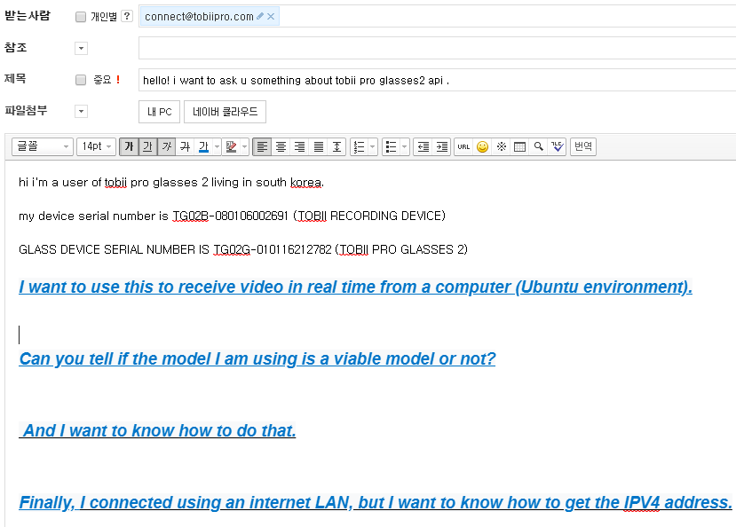
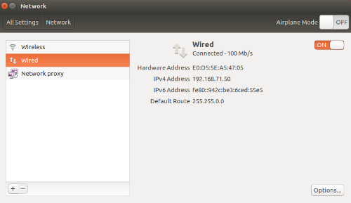
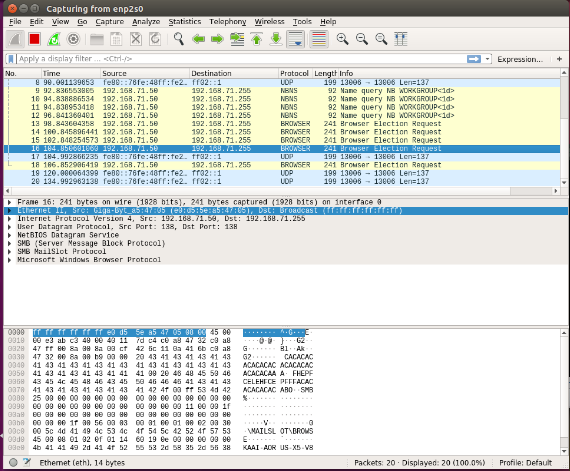
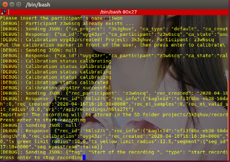
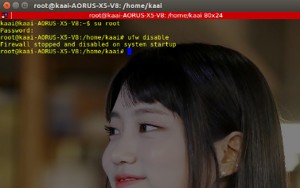
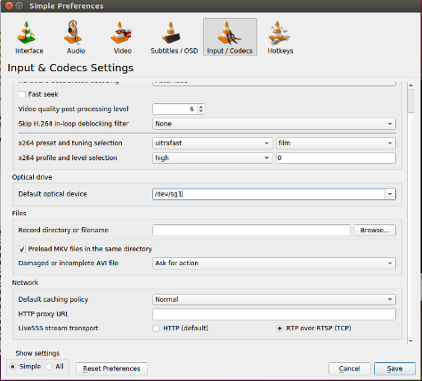
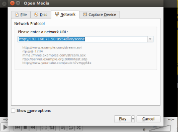
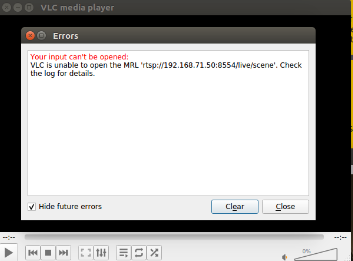
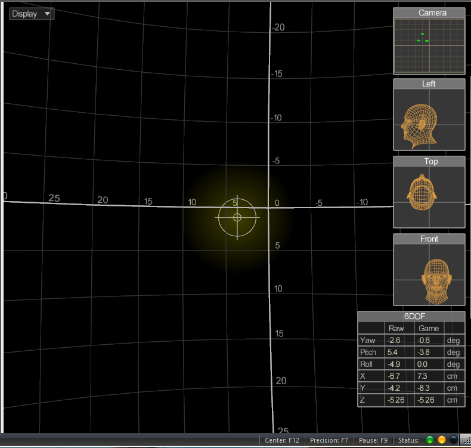

# eye-tracker-2주차

1. 시간 낭비하지  말고 질문하기

 Tobii pro glasses의 개발자팀에게 tobii pro glasses2로 wireless 통신이 가능한지 물어봤습니다.

최대한 답변이 오는대로 연구하여 다음 과정을 보고 드리겠습니다.

2. wireshark 어플리케이션을 이용하기

a.  아래를 진행하려면 기본적으로 네트워크의 세팅이 필요합니다.

-좀 더 정확한 정보를 얻기 위해서 wifi를 끄고 아이트래커와의 연결만 합니다.

b. ubuntu16.04에서 wireshark 어플리케이션을 이용하여, eye tracker의 패킷정보들을 얻어 오기

-여기서 아이트래커의 ipv4의 정보를 얻으려고 노력했습니다.

3.  아이트래커에서 얻은 정보들을 공부하기

현재, 구글과 아이트래커의 설명서를 읽으면서 중요한 정보를 공부하고 있습니다.

확실하게 연구하여 준비하여 보고 드리겠습니다.

4.  vlc 미디어 플레이어 어플리케이션 사용

a. 처음에 우분투의 방화벽을 차단해제 해줍니다.

code ;

su root

ufw disable

b.  vlc 미디어 플레이어에서 기본적인 네트워크 세팅이 필요합니다.

HTTP로 설정되어 있는 것을 RTP통신으로 바꿔줍니다.

c.  이제 연결을 하기 위해서 위에서 추출한 아이트래커의 IPV4 주소와 PORT번호를 사용해서 연결합니다.

d. 하지만 실행에 실패하였습니다.

++하지만 정확하게 무엇이 문제인지는 모르겠지만, eye tracker의 ip v4의 주소를 얻어오는 과정에서 문제가 있다고 생각된다.

++추가적으로 wireshark를 좀 더 공부하여 eye tracker의 ipv4의 주소를 얻어오면 문제가 해결될 것으로 예상된다.

5. 헤드트래커의 연결확인 

현재 헤드 트래커를 이용하여 컴퓨터와 연결하는데까지 성공했습니다.

연결한 것을 바탕으로 헤드 트래커에서의 정보를 컴퓨터로 보내고, 공부하겠습니다.

calibrate를 한다.