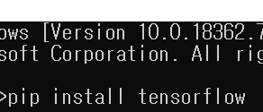

# eye-tracker-3주차

-headtracker

# 🤖yaw pitch roll 예측 모델 프로젝트

- headtracker과 웹캠을 이용하여 사람의 머리 운동방향의 정보를 얻습니다.
- 이후, 케라스를 이용하여 딥러닝하여, 이미지만을 이용하여 image(영상)으로
- yaw pitch roll 예측하는 모델을 개발하는 프로젝트를 진행했습니다.

## 2. 파이썬 3.5.4 설치하기

[https://www.python.org/downloads/](https://www.python.org/downloads/)을 들어가셔서 파이썬 버전 3.5.4를 다운받아 설치한 후 확인해줍니다.

## 3. 여러 패키지 설치하기

### 1. numpy(넘파이):

행렬이나 일반적으로 대규모 다차원 배열을 쉽게 처리 할 수 있도록 지원하는 파이썬의 라이브러리이다.  데이터 구조 외에도 수치 계산을 위해 효율적으로 구현된 기능을 제공

### 2. tensorflow(텐서플로우):

다양한 작업에대해 데이터 흐름 프로그래밍을 위한 오픈소스 소프트웨어 라이브러리이다. 

또한, 심볼릭 수학 라이브러리이자, 뉴럴 네트워크같은 기계학습 응용프로그램에도 사용

### 3. keras(케라스):

 파이썬으로 작성된 오픈 소스 신경망 라이브러리. 쉽게 말해, 딥러닝과 같은 학습을 하는곳에 사용된다.

### 4. pandas(판다스):

데이터 조작 및 분석을 위해 Python 프로그래밍 언어로 작성된 소프트웨어 라이브러리.

숫자 테이블 및 시계열을 조작하기위한 데이터 구조 및 조작을 제공

### 5. matplotlib(맷플랏라이브러리):

 파이썬에서 매트랩과 유사한 그래프 표시를 가능케 하는 라이브러리. 나중에 헤드트래커에서 얻은 정보를 정리하여 보여주는데 사용되는 라이브러리이다!!

### 6. sklearn(사이킷런): Python 프로그래밍 언어를위한 무료 소프트웨어 기계 학습 라이브러리

### 7. scikit-image(사이킷 이미지):

Python 프로그래밍 언어를위한 오픈 소스 이미지 처리 라이브러리

분할, 기하 변환, 색 공간 조작, 분석, 필터링, 형태, 특징 탐지 등을위한 알고리즘

### 8. image(이미지):

이미지 및 비디오의 자르기, 크기 조정, 썸네일 링, 오버레이 및 마스킹을 제공하는 Django 응용 프로그램

## 4. 웹캠으로 사진 데이터 수집하기

인수인계/data생성/ camera.exe실행해준다.

camera cap data 폴더에 웹캠이 찍은 영상이 image파일로 저장된다.

camera time.csv파일이 생성되는데 이것은 camera가 찍은 시간을 알려주는 역할을 한다.

찍은 사진들이 인풋데이터이다.

## 5. track ir v5.exe설치 하기

[https://www.naturalpoint.com/trackir/](https://www.naturalpoint.com/trackir/) 왼쪽의 페이지에 들어가서 head tracker를 위한 exe파일을 설치해준다.

alt+f7을 해주면 화면고정을 다시 실행시켜 줄 수 있다.

## 6. track ir sdk 설치하기

그냥 홈페이지에 들어가면 sdk를 얻을 수 없다. 그렇기 때문에 담당자에게 따로 메일을 보내서 sdk파일을 받아야한다. 

sdk의 압축을 풀어주고, 

C:\Users\찌워니컴퓨터\OneDrive\Desktop\TrackIR_Enhanced_SDK_2019_WIP\TrackIR_Enhanced_SDK_2019\Developer Package\Sample Code\Game Client Sample (cpp)에 들어가면 NPTest.proj를 실행 후 source file의 NPTestDlg를 클릭하여 타이머의 데이터 코드를 바꿔줘야 한다.

// Timer routine for test purposes -- simply pumps numbered text messages to the
// output window to check UI message scrolling, etc.
//
void CNPTestDlg::OnTimer(UINT_PTR nIDEvent)
{
TRACKIRDATA tid;
NPRESULT result;
CString csTimerMsg;
NPRESULT mydata = NP_GetData(&tid);
//Save the data as csv file
FILE* fp = fopen("test.csv", "at");
//Time measure
clock_t before;
double timeM;
before = clock();
for (int i = 0; i <32765; i++) printf("%dn", i);
timeM = (double)(clock() - before) / CLOCKS_PER_SEC;//fprintf(fp, "Pitch,Yaw,Roll,X,Y,Z,Status,FrameSignature\n");
fprintf(fp,
"%04.02f, %04.02f, %04.02f, %04.02f, %04.02f, %04.02f, %d, %d, %04.03f, %04.03f\n",
tid.fNPPitch,
tid.fNPYaw,
tid.fNPRoll,
tid.fNPX,
tid.fNPY,
tid.fNPZ,
tid.wNPStatus,
tid.wPFrameSignature,
timeM);
m_nTimerMessageNum++;
// "Poll" the NPClient interface for new TrackIR data, and process it if found
result = client_HandleTrackIRData();
if (result == NP_ERR_NO_DATA)
{
// csTimerMsg.Format( "No new data on timer call %d", m_nTimerMessageNum);
// DisplayLine( csTimerMsg );
}
CDialog::OnTimer(nIDEvent);
fclose(fp);
} // CNPTestDlg::OnTimer()9

위의 코드를 적절하게 쳐주고 디버그모드의 32비트(x86)환경에서 실행해준다.

그렇게 되면 nptest.exe가 생성된다.

→2020년 04월 23일 현재 지금 track ir 드라이버가 제대로 실행되지 않기 때문에 문제 해결 후 다시 실행해보겠습니다.

---

# live data 분석

   

# live data.json 의 저장된 형식

{"ts":3170668458,"s":0,"ac":[-0.471,-9.598,2.251]}

{"ts":3170569152,"s":0,"gy":[11.620,-13.868,-1.166]}

{"ts":3170660907,"s":0,"gidx":52598,"pc":[-31.86,-23.72,-26.34],"eye":"right"}

{"ts":3170660907,"s":0,"gidx":52598,"pd":4.02,"eye":"right"}

{"ts":3170660907,"s":0,"gidx":52598,"gd":[0.0352,0.3276,0.9442],"eye":"right"}

{"ts":3170680864,"s":0,"gidx":52599,"pc":[28.52,-23.18,-28.38],"eye":"left"}

{"ts":3170680864,"s":0,"gidx":52599,"pd":4.04,"eye":"left"}

{"ts":3170680864,"s":0,"gidx":52599,"gd":[-0.0630,0.2838,0.9568],"eye":"left"}

{"ts":3170660907,"s":0,"gidx":52598,"l":119702,"gp":[0.5377,0.2307]}

{"ts":3170660907,"s":0,"gidx":52598,"gp3":[-6.66,159.54,533.55]}

ts - time stamp

연속적으로 데이터를 저장할 때 시간을 표시

s - status

데이터의 status를 나타내며 0일 경우 정상,그 외의 숫자일 경우 비정상

ac-accelerometer

안경의 회전가속도를 표시. 가속도계 데이터의 초당 미터 제곱은

[m / s²]. 안경의 움직임이 없을 때 ac 속성 값은 대략 [0, -9,82, 0]입니다.

gy - Gyroscope

안경의 회전데이터 , 초당 단위 각도 [° / s]

gidx-

pc - Pupil Center

속성 pc는 scenecam에서 3D 좌표로 지정 . 눈 위치를 비교하는 데 사용

좌표는 mm.

pd - pupil diameter

동공 직경은 mm 단위로 측정되며 각 눈에 대해 별도로 전송

gd - Gaze Direction

시선 방향은 각막 위치 (또는 가능하면 동공 중심)의 단일 백터.

gp - gaze point

장면의 위치

시선이 투사 될 카메라 이미지

왼쪽 상단은 (0,0)이고 오른쪽 하단은

(1,1)

gp3 - gaze point 3d

GazePosition3d는 시선이 집중된 장면 카메라를 기준으로 한 3D 위치 (mm).