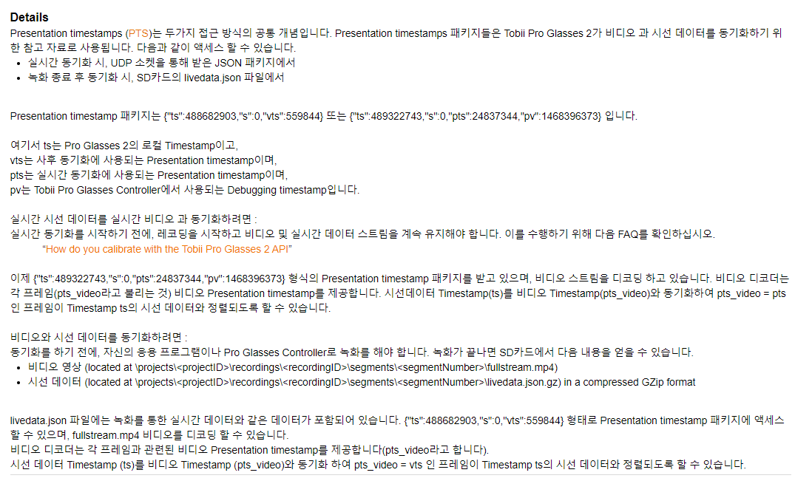
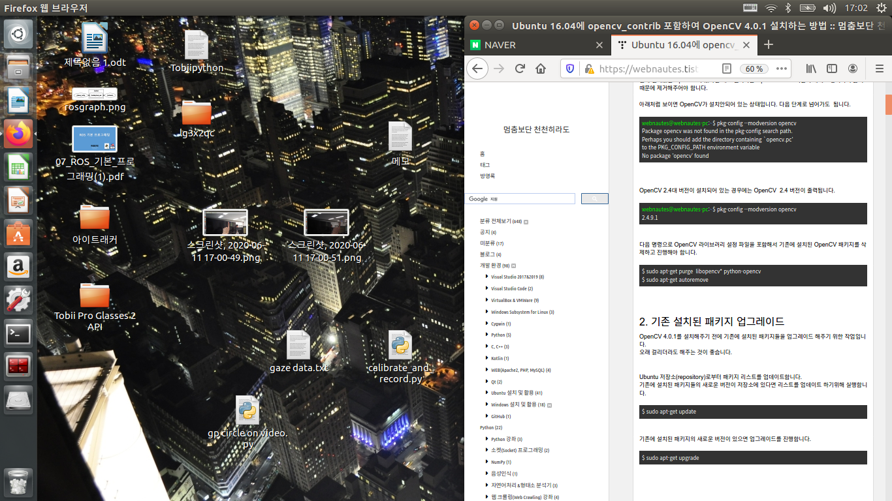
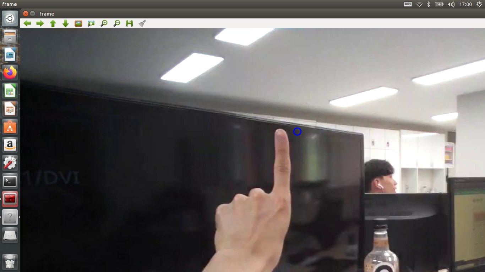

# eye-tracker-8주차

목차

1. 피드백 접수
2. Tobii Pro Lab
3. 윈도우 환경에서 darknet사용하기
4. 우분투 환경에서 opencv설치하기

## 1. 피드백 접수

교수님의 피드백을 바탕으로 원래 하는 방식 그대로를 유지하기로 했습니다.

원래는 정확한 시간을 찾기 위해서 TOBII설명서에 있는 PTS와 VTS를 찾아 비교하여 시간을 구하려 했으나, 발견한 PTS와 VTS의 값 차이가 매우 크고 맞지 않는 값이었기 때문에 원래, 이전에 했던 방식을 고수하기로 했습니다.

자세하게 알고 싶어서 TOBII PRO GLASSES 2API를 확인했습니다.

ts 타임 스탬프 값은 마이크로 초입니다. pts 타임 스탬프 값의 분해능은 90kHz입니다. 그만큼
Pro Glasses 레코딩 장치는 클라이언트가 번역 할 수 있도록 pts 동기화 패키지 (32 페이지 C6.1.8 PTS 동기화 패키지 참조)를 보냅니다.
비디오 스트림 시간 (pts)까지의 데이터 스트림 시간 (ts). 동기화에서 ts 속성과 pts 속성 사이의 오프셋을 사용하십시오.
시선 데이터를 라이브 비디오 스트림과 동기화하기 위해 패키지.

시선 데이터 스트림에는 ts 시간과 vts 시간 사이에 VTS 동기화 패키지가 포함됩니다. 라이브 비디오(이게 PTS) 및 시선 데이터, 비디오 파일은 키프레임으로 시작합니다

### *결론

### 하지만, 이 방법으로는 원하는 데이터를 얻을 수 없었습니다.

### 따라서, 원래 진행하던 방법인 '프레임을 초로 변환하여 TS을 얻는 방법'을 사용하기로 했습니다.

타임스탬프를 걸러내는 시간을 0.04s였는데 이것을 0.031s로 바꿔서 진행했습니다.

0.04와 0.02 등등 다양한 시간으로 실험을 진행했는데 0.031s이 gaze point의 sync가 가장 잘 맞다고 생각해서 선택하게 되었습니다.

얻어온 livadata.json에서 gp가 있다면 추출하여 딕셔너리안의 딕셔너리로 저장하는 코드

livedata_af_edit2.json의 이름으로 아래와 같이 저장됩니다.

위의 livedata로 동영상 위에 원을 그려주는 프로그램을 cmd를 통해서, 그려줍니다.

각 프레임과 타임스탬프에 맞게 굉장히 미세한 차이가 있긴 하지만, 원하는 대로 잘 그려집니다.

사람을 응시하는 경우

## 2. Tobii Pro Lab

저번에 교수님께서 피드백 해주신대로 TOBII PRO LAB을 설치하고 설명서를 정독했습니다.

형광펜으로 칠한 매뉴얼을 다운받으면 됩니다.

자세한 설명이 있는 메뉴얼. 아직은 메뉴얼을 보고 공부하는 단계이다...ㅜ

## 3.윈도우 환경에서 darknet 돌리기

YOLO DARKNET을 윈도우에서 돌리게 하는 방법을 연구했습니다.

아래에 첨부된 네이버 블로그에서 참고하여 cudnn, cuda, opencv, darknet을 시도했습니다.

[https://m.blog.naver.com/gorillamoon/221185312341](https://m.blog.naver.com/gorillamoon/221185312341)

하지만, 올려져 있는 예제를 돌리다 아래의 사진처럼 오류가 나서 진행이 막혔습니다.

다음주에, 좀 더 구글에서 찾아서 오류를 해결할 것입니다.

## 4. 우분투 환경에 OPENCV를 설치했습니다.

원래 darknet과 yolo는 우분투 환경에 더 최적화되어 있기 때문에 우분투환경에서 구동시켜 보았습니다.

위의 윈도우 환경에서 프로그램을 우분투환경에서 실행한 결과입니다.

아래의 사진과 같이 초점(손가락방향)과 측정된 포인트(파란원)이 대체적으로 잘 sync가 되는 모습입니다.

다음주에는 우분투 환경에 darknet을 설치하겠습니다.