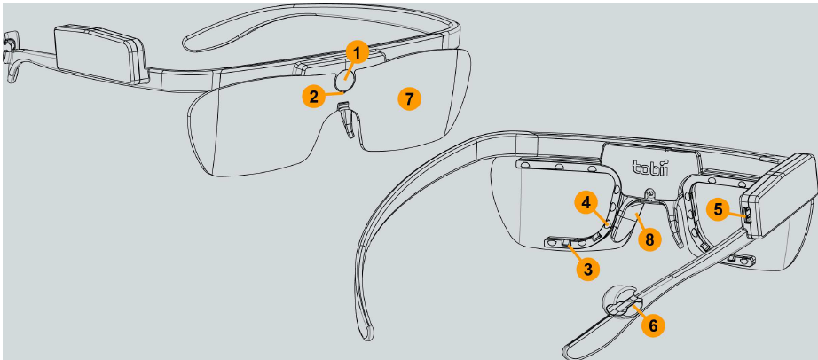
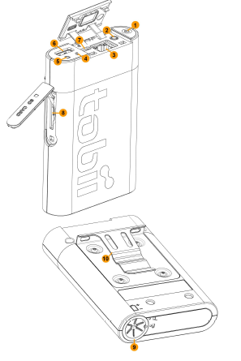
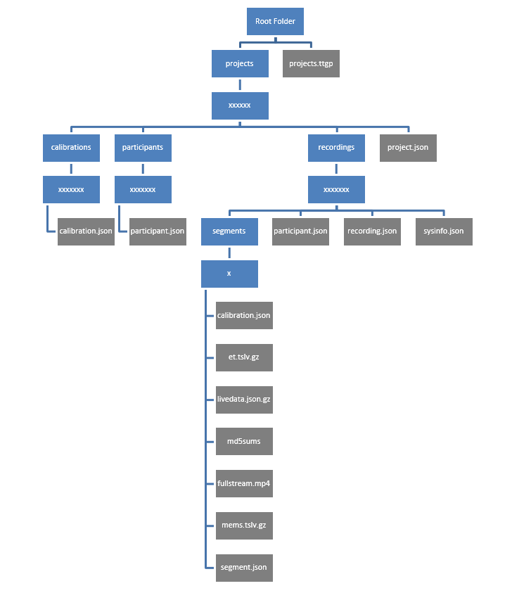
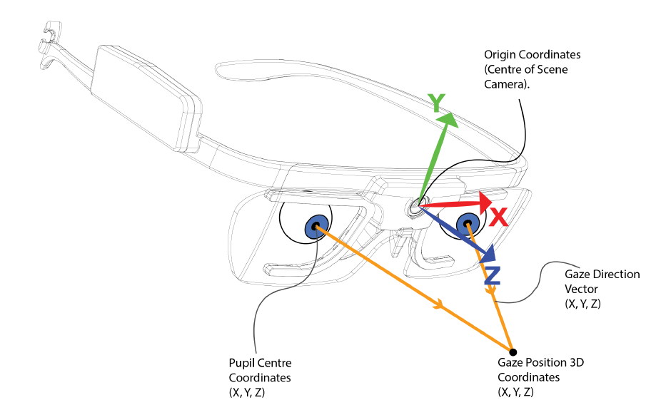
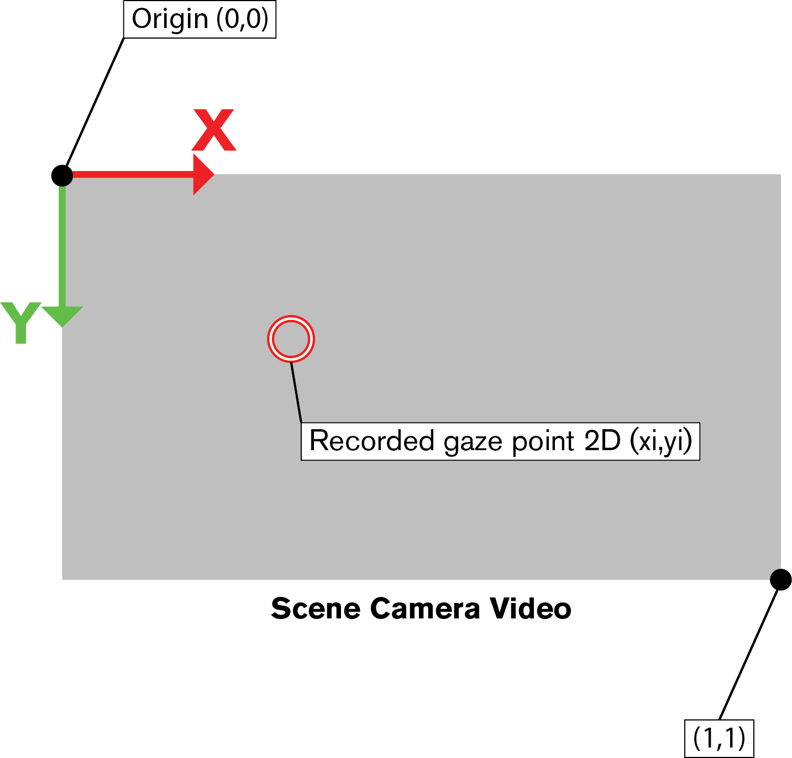

# 1. Tobii pro glasses 2

# 1.  tobii eyetracker



Head Unit



Recording Unit 

- 설명에 앞서 이 보고서에서 위 두 그림의 첫번째 그림의 장치를 Head Unit이라 칭하고 두번째 그림의 장치를 Recording Unit이라 칭한다.

## 1) User Manual

1-1) 위 장치를 사용하기위해서 먼저 Head Unit의 5번단자와 Recording Unit의 6번 단자에 하나의 선을 연결 해준다. 

1-2) Recording Unit의 이더넷 단자와 노트북이나 컴퓨터의 이더넷단자를 연결해 준다. 

1-3)  Recording Unit의 측면에 SD카드가 잘 삽입되어있는지 확인하고 전원버튼 (터치형) 을 길게 눌러 전원을 켜준다. 

1-4) 전원 표시등에 불이 들어와 있으면 전원이 켜져 컴퓨터와 연결된 상태를 의미하므로 이는 성공적인 연결을 의미한다. 
1-5) 이 후 연결된 컴퓨터에서 프로그램을 실행시켜 시선추적기를 작동시킨다. 

[https://www.tobiipro.com/ko/product-listing/tobii-pro-glasses-2/](https://www.tobiipro.com/ko/product-listing/tobii-pro-glasses-2/)  → tobii pro 홈페이지 

위 링크를 통해 tobii pro glasses Controller 를 다운받아 연결이 잘 되었고 작동이 정상적으로 되는지 확인해보길 바란다. 


Controller 를 실행한 모습 

## 2) Eye tracker data

2-1) 시선추적기를 통해 녹화된 정면 video와 gaze point는 다음과 같은 파일 구조로 SD카드에 저장되게 된다.

XXXXX = 무작위 파일명 



2-2)측정된 gaze point는 json형태로 저장되게 된다. (파이썬의 dictionary와 비슷하다고 생각하면 됨)



# live data.json 의 저장된 형식

아래 데이터는 json형식으로 저장된 몇가지 예시들이다. 

{"ts":3170668458,"s":0,"ac":[-0.471,-9.598,2.251]}

{"ts":3170569152,"s":0,"gy":[11.620,-13.868,-1.166]}

{"ts":3170660907,"s":0,"gidx":52598,"pc":[-31.86,-23.72,-26.34],"eye":"right"}

{"ts":3170660907,"s":0,"gidx":52598,"pd":4.02,"eye":"right"}

{"ts":3170660907,"s":0,"gidx":52598,"gd":[0.0352,0.3276,0.9442],"eye":"right"}

{"ts":3170680864,"s":0,"gidx":52599,"pc":[28.52,-23.18,-28.38],"eye":"left"}

{"ts":3170680864,"s":0,"gidx":52599,"pd":4.04,"eye":"left"}

{"ts":3170680864,"s":0,"gidx":52599,"gd":[-0.0630,0.2838,0.9568],"eye":"left"}

{"ts":3170660907,"s":0,"gidx":52598,"l":119702,"gp":[0.5377,0.2307]}

{"ts":3170660907,"s":0,"gidx":52598,"gp3":[-6.66,159.54,533.55]}

ts - time stamp

연속적으로 데이터를 저장할 때 시간을 표시

s - status

데이터의 status를 나타내며 0일 경우 정상,그 외의 숫자일 경우 비정상

ac-accelerometer

안경의 회전가속도를 표시. 가속도계 데이터의 초당 미터 제곱은

[m / s²]. 안경의 움직임이 없을 때 ac 속성 값은 대략 [0, -9,82, 0]입니다.

gy - Gyroscope

안경의 회전데이터 , 초당 단위 각도 [° / s]

pc - Pupil Center

속성 pc는 scenecam에서 3D 좌표로 지정 . 눈 위치를 비교하는 데 사용

좌표는 mm.

pd - pupil diameter

동공 직경은 mm 단위로 측정되며 각 눈에 대해 별도로 전송

gd - Gaze Direction

시선 방향은 각막 위치 (또는 가능하면 동공 중심)의 단일 백터.

gp - gaze point

장면의 위치

시선이 투사 될 카메라 이미지

왼쪽 상단은 (0,0)이고 오른쪽 하단은

(1,1)

gp3 - gaze point 3d

GazePosition3d는 시선이 집중된 장면 카메라를 기준으로 한 3D 위치 (mm).



## 3) 실행 프로그램 - calibrate_and_record.py

[https://github.com/ddetommaso/TobiiGlassesPyController](https://github.com/ddetommaso/TobiiGlassesPyController)  → 시선추적기 관련 코드 github

먼저 위 링크를 통해 모든 코드를 다운받는다. 

모든코드를 한번쯤 훝어보길 바란다.

아래코드는 calibrate_and_record.py 와 streamin.py파일을 합성한 것으로 그 이유는 다음과 같다. 

1) 저장된 json파일 형식의 gp(gaze point)는 이용하기에 번거롭다. 따라서 녹화가 시작되고 끝나는 동시에 txt파일로 저장하여 입출력이 쉽게 편집 (csv로도 가능 ) 
2) 영상의 frame속도와 gp가 저장되는 time stamp속도가 다르기 때문에 sync의 한 방법으로 대체 가능 (핵심)

```jsx
# calibrate_and_record.py : A demo code for calibrating and recording
#
# Copyright (C) 2019  Davide De Tommaso
#
#   This program is free software: you can redistribute it and/or modify
#   it under the terms of the GNU General Public License as published by
#   the Free Software Foundation, either version 3 of the License, or
#   (at your option) any later version
#
#   This program is distributed in the hope that it will be useful,
#   but WITHOUT ANY WARRANTY; without even the implied warranty of
#   MERCHANTABILITY or FITNESS FOR A PARTICULAR PURPOSE.  See the
#   GNU General Public License for more details.
#
#   You should have received a copy of the GNU General Public License
#   along with this program.  If not, see <https://www.gnu.org/licenses/>

import time
from tobiiglassesctrl.controller import TobiiGlassesController

if hasattr(__builtins__, 'raw_input'):
      input=raw_input

def main():
        f=open("C:\Users\LG\Desktop\gaze_point.txt","w")//파일 저장 위치 
            
	tobiiglasses = TobiiGlassesController()
	print(tobiiglasses.get_battery_info())
	print(tobiiglasses.get_storage_info())

	if tobiiglasses.is_recording():
		rec_id = tobiiglasses.get_current_recording_id()
		tobiiglasses.stop_recording(rec_id)

	project_name = input("Please insert the project's name: ")
	project_id = tobiiglasses.create_project(project_name)

	participant_name = input("Please insert the participant's name: ")
	participant_id = tobiiglasses.create_participant(project_id, participant_name)

	calibration_id = tobiiglasses.create_calibration(project_id, participant_id)
	input("Put the calibration marker in front of the user, then press enter to calibrate")
	tobiiglasses.start_calibration(calibration_id)

	res = tobiiglasses.wait_until_calibration_is_done(calibration_id)

	if res is False:
		print("Calibration failed!")
		exit(1)

	recording_id = tobiiglasses.create_recording(participant_id)
	print("Important! The recording will be stored in the SD folder projects/%s/recordings/%s" % (project_id, recording_id))
	input("Press enter to start recording")
	tobiiglasses.start_recording(recording_id)
	tobiiglasses.send_custom_event("start_recording", "Start of the recording ")
//calirate의 성공 이후 recording 시작 
	#-------------------------------------------------------------------------------------------------------------------------
	
	
	tobiiglasses.start_streaming()// recording 시작후 즉시 streaming을 이용해 gp_data 추출
	while True:
              
              try:
                   time.sleep(0.033)// 영상의 frame속도와 time stamp속도가 어느정도 일치하게 하는  지연 시간 
                   gp_data=str(tobiiglasses.get_data()["gp"])
                   if "-1" in gp_data:
                         pass//-1은 의미없는 값이기 때문 
                   else://json형식에서 gp데이터만을 추출하여 저장하는 과정 
                         index1=gp_data.find("[")
                         index2=gp_data.find("]")
                         gp_data=gp_data[index1+1:index2]
                         gp_data=gp_data.replace(",","")
                         gp_data=gp_data.replace("\n","")

                   f.write(gp_data)
                   f.write("\n")
                  
                   
              except(KeyboardInterrupt)://while문 탈출 조건을 KeyboardInterrupt로 하여 
		   break                            //그 전까지 계속하여 저장함 
#--------------------------------------------------------------------------------------------------------
        
        
	tobiiglasses.send_custom_event("stop_recording", "Stop of the recording " + str(recording_id))
	tobiiglasses.stop_recording(recording_id)
        
//recording 종료
	if res is False:
		print("Recording failed!")
		exit(1)

if __name__ == '__main__':
    main()
```

위 코드는 녹화시에 사용한 코드이다. 자세한 설명은 코드에 주석으로 달아놨으며 단순한 구조이다.

위 코드를 이용하여 녹화를 마치면 우리에게 두가지 데이터가 있다. 
1. livestream → 전방카메라 녹화영상 
2. gaze_point.txt → gp데이터 

두 데이터는 이미 녹화과정에서 sync를 마친 데이터라고 볼 수 있다.

따라서 이후에 이 두데이터를 적절히 활용하여 적용한다.