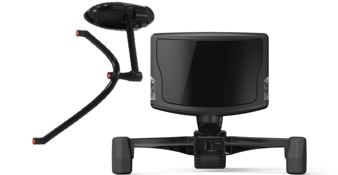

# 2. Head Tracker

## 정의

 TrackIR 은 게임자 머리의 위치와 방향을 찾고 그 데이터를 어떠한 프로그램이나 시뮬레이션으로도 보낼 수 있다 . 따라서 3차원 공간에서 실제 머리의 움직임으로 여러분의 게임 화면을 제어할 수 있다 .

## 현재 사용하고 있는 헤드 트래커와 기본 구성

 Natural Point사의 TrackIR5를 현재 사용하고 있다.

a. TrackClip PRO는 카메라에 적외선을 직접 보내는 액티브 LED 마커가 포함되어 있다

b. 두 개의 트랙 클립 중 하나를 사용하여 머리의 위치를 추적하는 적외선 카메라다 .

## 사용하는 소프트웨어

a. 기본적으로 제공되는 Natural Point사에서 제공되는 소프트웨어

[TrackIR_5.4.2.exe](https://s3.amazonaws.com/naturalpoint/trackir/software/TrackIR_5.4.2.exe)

특징: 사용법이 매우 간단한 반면에 소프트웨어 화면상의 데이터를 전송하거나 사용할 수 없는 것이 특징! 현재 헤드트래커가 정상적으로 작동하는지 확인하는데에만 사용하면 된다!

b. Natural Point사에서 제공하는 개발자 전용 소프트웨어

[head_tracker사용.zip](head_tracker.zip)

특징: 압축파일을 다운받아 압축을 해제하면 NPTEST의 솔루션 파일이 있다. 이것을 통해 자신이 원하는 대로 NPTEST의 코드수정을 통하여 빌드를 하면 된다. data생성 폴더에 들어가면 이미 nptest를 빌드한 폴더 또한 존재한다. 하지만, nptest는 exe로 빌드되기 때문에 window환경에만 유효하다. *ubuntu환경에서는 사용이 불가능하다.

c. Linux Tracker

[https://github.com/GNOME/tracker](https://github.com/GNOME/tracker)

특징: ros를 사용하여 데이터를 하나로 집약시켜, 실질적으로 사용하려면 linux tracker를 사용해야 한다. 위의 github링크의 wiki부분을 들어가면 설치방법이 있다. 여기서 순차적으로 시키는대로하면 linux tracker가 설치된다. 이후, lidar, camera, can, eye tracker와 같이 다양한 센서와 실시간으로 데이터를 주고 받으며 통신하면 된다.

*주의! 프로그램이 굉장히 불안정하기 때문에 설치 도중이나 설치완료 이후 ubuntu가 통채로 날아갈 수 있으니 주의할 것!