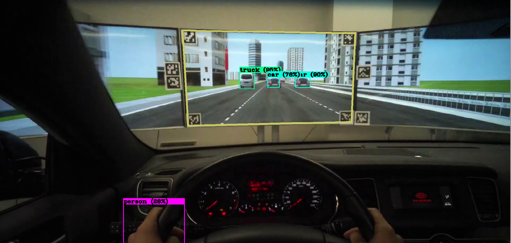
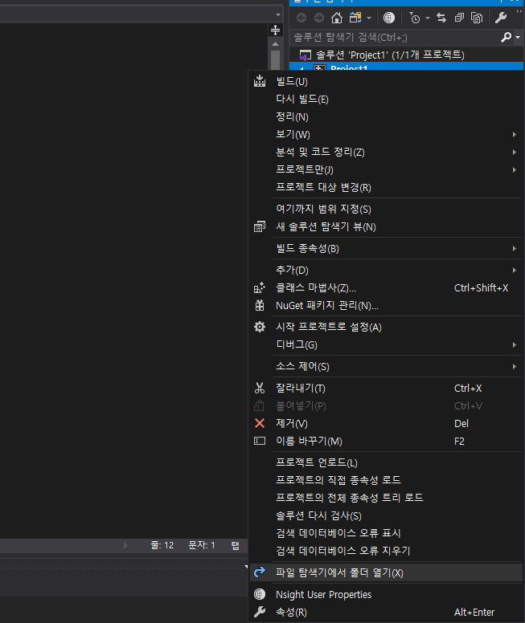
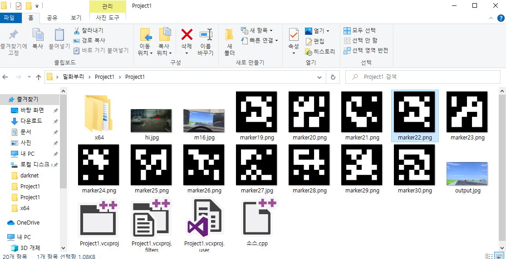

# 4. ARUCO Marker

## marker의 필요성



모니터의 모서리에 aruco marker가 부착된 사진

결론부터 말하자면 marker가 있어야 원하는 데이터를 갖고 올 수 있다.

eye tracker를 사용하여 1920*1080 동영상을 생성한다면 1920*1080개의 좌표 있을 것이다. 

우리는 이곳에서 하나의 시선좌표(gaze point)를 받아온다.  

우리가 eye tracker를 사용하는 최종적인 목표는 자신이 바라보는 물체가 무엇인지 알아내는 것인데 marker가 있어야 모니터상의 원하는 데이터만 가져올 수 있다.

## Aruco Marker 설치 방법( opencv_contrib )

*일반적인 opencv를 통해서는 aruco marker를 사용할 수 없다. extra module이 있는 opencv_contrib를 사용해야 aruco marker를 사용할 수 있다.

**OpenCV Extra Modules**

OpenCV에서 새로운 API가 추가되는 경우 안정성이나 성능이 검증되지 않은 경우 공식 배포를 하지 않고, Extra Modules(opencv_contrib)에 포함시키게 된다. 내가 써보고싶었던 Slic algorithm도 여기에 포함되어있다.

**설치환경 : Visual Studio 2013, Windows 32bit**

64bit 환경에서의 설치는 아래 링크를 참고하기를 바란다. 꽤 자세히 나와있다.

[https://putuyuwono.wordpress.com/2015/04/23/building-and-installing-opencv-3-0-on-windows-7-64-bit/](https://putuyuwono.wordpress.com/2015/04/23/building-and-installing-opencv-3-0-on-windows-7-64-bit/)

**1. CMAKE 3.7.0 다운로드**

**[https://cmake.org/download/](https://cmake.org/download/)**

나는 Windows win32-x86 ZIP 를 다운 받았고 압축을 풀어주었다.

**2. OpenCV 3.0 or 3.1 다운로드**

**[http://opencv.org/downloads.html](http://opencv.org/downloads.html)**

나는 이미 3.0 버전이 깔려있었다.

**3. OpenCV contrib**

**[https://github.com/opencv/opencv_contrib](https://github.com/opencv/opencv_contrib)**

여기서 Clone or download 초록 버튼을 눌러 zip 파일로 다운한 뒤 C드라이브에 압축을 풀어주었다. 이 페이지에 OpenCV's extra modules 에 대한 전반적인 내용이 담겨있다. 이를 보고 따라해도 되지만 더 설명이 필요한 것 같아서 포스팅해본다.

**1. CMAKE 설정**

설치하였던 **cmake 폴더 - bin 폴더 - cmake-gui.exe 파일을 실행**

**Where is the source code - C:\opencv\sources**

이 부분에 기존에 설치하였던 opencv 3.0 의 sources 경로를 입력해주었다. 새로 OpenCV를 설치하였다면 그 폴더의 sources 폴더의 경로를 입력해주면 된다.

**Where to build the binaries - C:\opencv_extra_build**

이 부분은 C 드라이브에 **"opencv_extra_build"** 라는 폴더를 새로이 생성해주고, 경로를 입력했다.

경로를 모두 다 입력한 뒤 **"Configure"** 를 누른다.

그러면 창 하나가 뜨는데 자신의 비주얼 버전에 맞게 입력해주고 **(Visual Studio 12 2013)**

**Use default native compliers 에 체크**해주고 Finish를 누른다.

그러면 아래와 같이 빨갛게 변하면서 맨 아래 창에 Configureing done 이라는 메세지가 뜬다.

[https://t1.daumcdn.net/cfile/tistory/2454DE4D5829A37E06](https://t1.daumcdn.net/cfile/tistory/2454DE4D5829A37E06)

이 과정이 끝나면 **opencv_contrib/modules/bioinspired  라는 폴더를 삭제**해준다. 삭제하지 않고, 비주얼 프로젝트를 생성하고 빌드하게 되면 에러메세지가 나타난다고 한다.

그 다음 빨갛게 표시된 부분에서 **"OPENCV_EXTRA_MODULES_PATH"에서 다운받았던 opencv_contrib-master의 modules 디렉토리로 지정**한다.

라고 많은 블로그들과 git에 나와있었는데 나는 계속 Call Stack (most recent call first) 빨간줄 에러가 떠서 **opencv_contrib-master 까지의 경로만 입력해주었더니 Configure에 성공**하였다.

경로를 입력해주고, 필요한 파일을 체크하고 필요없는 파일을 체크 해제 해준다.

OpenCV 카페에서 찾아본 내용에 의하면 **opencv world, contrib world는 체크하게 된다면 일부 파일에서 링크오류가 나기 때문에 가급적이면 체크를 해제한 상태로 두는게 낫다**고 한다.

[http://cafe.naver.com/opencv/11896](http://cafe.naver.com/opencv/11896) (이 글 참조)

**경로 입력해준 뒤 필요없는 파일을 체크하고 Configure 버튼을 누르게 되면,**

**아래와 같이 맨 및 창에 Configuring done 이라는 메세지가 뜬다.**

[https://t1.daumcdn.net/cfile/tistory/27588F4D5829A37E02](https://t1.daumcdn.net/cfile/tistory/27588F4D5829A37E02)

그 다음 Generate 버튼을 눌러주면 아래와 같이 뜬다. 그럼 이제 Cmake 설정은 끝이 났다.

[https://t1.daumcdn.net/cfile/tistory/2349974D5829A37F13](https://t1.daumcdn.net/cfile/tistory/2349974D5829A37F13)

**2. Visual Studio 설정**

[https://t1.daumcdn.net/cfile/tistory/2476A0415829A9B905](https://t1.daumcdn.net/cfile/tistory/2476A0415829A9B905)

CMAKE 설정이 완료되면, 아까 새로 생성했던 **opencv_extra_build 폴더에서 "OpenCV" 프로젝트 파일을 열어준다.** 그 다음 **CMakeTargets 이라는 폴더의 INSTALL 파일을 우클릭하고, build** 를 눌러준다. 나는 Debug 모드로 실행하였고, 빌드에 실패할 경우 실패된 파일은 쓸 수 없다.

그러면 조금 시간이 걸리긴 하지만 build가 되기 시작한다.

[https://t1.daumcdn.net/cfile/tistory/2421F1445829A9CA1A](https://t1.daumcdn.net/cfile/tistory/2421F1445829A9CA1A)

**아래와 같이 빌드에 모두 성공하게 되었다.**

[https://t1.daumcdn.net/cfile/tistory/25132E465829AAC803](https://t1.daumcdn.net/cfile/tistory/25132E465829AAC803)

**3. 환경변수 설정 및 프로젝트 속성 설정**

**3-1. 환경변수 설정**

**시스템 속성 - 고급 시스템 설정 - 환경변수 - 시스템 변수 - Path 편집**

자신이 만든 opencv_extra_build 폴더의 bin 폴더를 추가해준다.

C:\opencv_extra_build\install\x86\vc12\bin; 추가

**3-2. 비주얼 스튜디오 프로젝트 속성 설정**

1. 프로젝트 속성 - C / C++ - 추가 포함 디렉터리 - include

C:\opencv_extra_build\install\include

2. 링커 - 입력 - 추가 종속성 라이브러리 추가

C:\opencv_extra_build\install\x86\vc12\lib

편하게 lib 복사하는 법은 해당 폴더에 list.txt 파일을 만들고 dir /b /oe > list.txt 를 입력하고 저장한다. 그리고 list.txt -> list.bat 파일로 변경하고 실행한다. 그러면 list에 해당 폴더에 있는 내용들이 메모장에 출력되는 것을 확인할 수 있단다. 그런데 나는 이것 마저 어렵게 느껴져서 그냥 하나씩 다 입력했다...ㅋㅋ

debug 모드에선 마지막에 d를 붙이고, Release 모드에선 d를 빼고 입력해준다.

```jsx
opencv_calib3d300d.lib
```

```jsx
opencv_core300d.lib
```

```jsx
opencv_features2d300d.lib
```

```jsx
opencv_flann300d.lib
```

```jsx
opencv_hal300d.lib
```

```jsx
opencv_highgui300d.lib
```

```jsx
opencv_imgcodecs300d.lib
```

```jsx
opencv_imgproc300d.lib
```

```jsx
opencv_objdetect300d.lib
```

```jsx
opencv_photo300d.lib
```

```jsx
opencv_shape300d.lib
```

```jsx
opencv_stitching300d.lib
```

```jsx
opencv_superres300d.lib
```

```jsx
opencv_ts300d.lib
```

```jsx
opencv_video300d.lib
```

```jsx
opencv_videoio300d.lib
```

```jsx
opencv_videostab300d.lib
```

설정 끝!

## Aruco Marker를 사용하는 방법

```cpp
#include <opencv2/opencv.hpp>
#include <opencv2/aruco.hpp>

using namespace cv;
using namespace std;

int main()
{

	cv::Mat markerImage;
	cv::Ptr<cv::aruco::Dictionary> dictionary = cv::aruco::getPredefinedDictionary(cv::aruco::DICT_6X6_250);
	cv::aruco::drawMarker(dictionary, 22, 200, markerImage, 1);
	cv::imwrite("marker22.png", markerImage);

}
```

#include <opencv2/opencv.hpp>

*opencv를 사용하겠음!

#include <opencv2/aruco.hpp>

*opencv의 추가 라이브러리인 aruco를 사용하겠음!

cv::Mat markerImage;

*markerimage라는 행렬을 선언

cv::Ptr[cv::aruco::Dictionary](cv::aruco::Dictionary) dictionary = cv::aruco::getPredefinedDictionary(cv::aruco::DICT_6X6_250);

*aruco를 사용하기 위한 딕셔너리를 선언

cv::aruco::drawMarker(dictionary, 22, 200, markerImage, 1);
cv::imwrite("marker22.png", markerImage);

*사이즈가 200*200고 id가 22인 마커를 1개 생성한다는 코드*

프로젝트에서 오른쪽 마우스 클릭하여 확인!



비주얼스튜디오2019의 c++환경에서 위의 코드를 돌리면 프로젝트 폴더에 아래와 같이 생성된다.



위의 코드를 인쇄하여 모니터화면의 적당한 위치에 붙여 코드를 완성시키자!

## darknet 적용하기!

darknet의 솔루션에 들어가서 image_opencv.cpp에 들어가서 1000번째 줄을 확인하자!

```jsx
cv::Ptr[cv::aruco::Dictionary](cv::aruco::Dictionary) dictionary = cv::aruco::getPredefinedDictionary(cv::aruco::DICT_6X6_250); 
```

*aruco를 사용하기 위해 딕셔너리 코드를 작성한다.

int ak47 = 0;

*타임스탬프를 찍기 위한 변수 선언!

```jsx
Point2f inputQuad[4];
Point2f outputQuad[4];
Mat input, output;
```

*inputQuad와 outputQuad는 qr코드의 좌표를 얻기 위한 포인트변수이다!

```jsx
std::vector<int> ids;
std::vector<std::vector[cv::Point2f](cv::Point2f) > corners;
```

*각 qr코드의 좌표의 ids, corners들을 담기 위한 벡터 선언

```jsx
cv::aruco::detectMarkers(*show_img, dictionary, corners, ids);
if (ids.size() > 0)
cv::aruco::drawDetectedMarkers(*show_img, corners, ids);
```

*qr코드를 detecting하는 aruco의 코드 이것은 필수!

```jsx
int s = ids.size();
```

*발견된 아이디들의 사이즈를 담는 변수 s (*qr코드의 개수가 저장된다.)

```jsx
cv::Point2i top_left, top_right, bot_left, bot_right;
cv::Point2i nullQR(0, 0);
cv::Point2f gPoint(myint1, myint2);
```

*top_left,top_right,bot_left,bot_right가 담기는 포인트 변수와, 아무qr코드도 발견되지 않았을 때, 담겨지는 좌표(0,0),  myint1(x)와 myint2(y)는 gpoint에 담긴다.

```jsx
for (int i = 0; i < ids.size(); i++) {
if (ids[i] == 19) { cv::Point2f temp(corners[i][0].x, corners[i][0].y); top_left = temp; }
else if (ids[i] == 20) { cv::Point2f temp(corners[i][0].x, corners[i][0].y); top_right = temp; }
else if (ids[i] == 21) { cv::Point2f temp(corners[i][0].x, corners[i][0].y); bot_left = temp; }
else if (ids[i] == 22) { cv::Point2f temp(corners[i][0].x, corners[i][0].y); bot_right = temp; }
```

```
else if (ids[i] == 23) { cv::Point2f temp(corners[i][0].x, corners[i][0].y); top_left = temp; }
else if (ids[i] == 24) { cv::Point2f temp(corners[i][1].x, corners[i][1].y); top_right = temp;}
else if (ids[i] == 25) { cv::Point2f temp(corners[i][3].x, corners[i][3].y); bot_left = temp;}
 else if (ids[i] == 26) { cv::Point2f temp(corners[i][2].x, corners[i][2].y); bot_right = temp;}

else if (ids[i] == 27) { cv::Point2f temp(corners[i][2].x, corners[i][2].y); top_left = temp; }
else if (ids[i] == 28) { cv::Point2f temp(corners[i][2].x, corners[i][2].y); top_right = temp; }
else if (ids[i] == 29) { cv::Point2f temp(corners[i][2].x, corners[i][2].y); bot_left = temp; }
else if (ids[i] == 30) { cv::Point2f temp(corners[i][2].x, corners[i][2].y); bot_right = temp; }
```

*발견된 qr코드의 좌표들이 for문이 돌아가면서 저장된다.

```jsx
inputQuad[0] = top_left;//왼쪽위
inputQuad[1] = top_right;//오른쪽위
inputQuad[2] = bot_right;//오른쪽아래
inputQuad[3] = bot_left;//왼쪽아래
outputQuad[0] = Point2f(0, 0);
outputQuad[1] = Point2f(input.cols - 1, 0);
outputQuad[2] = Point2f(input.cols - 1, input.rows - 1);
outputQuad[3] = Point2f(0, input.rows - 1);
```

*top_left,top_right,bot_right,bot_left가 두 변수에 저장된다.

```jsx

```

*화면상에서 왜곡되어 보이는 화면을 2차원의 평면으로 보여주는 코드(perspective transform)을 사용하여 투영한다.