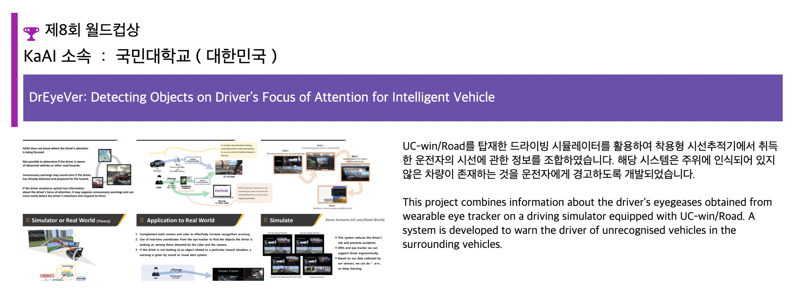
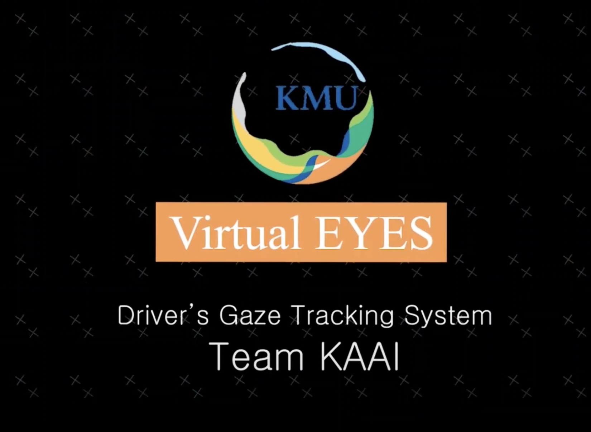

# CPWC 대회 준비 Archivie

## 프로젝트 진행 정보 
**수행 기간** : 2020 1월 - 2021 1월   
**담당** : Eye Tracker(시선 추적기), Head Tracker  
**프로젝트 주제** : 시선 추적기를 이용한 운전자의 위험 감지 여부 판단 시스템 개발  
**진행 계획** : Eye-tracker의 시선데이터를 Object Detection Model(YOLO v3)에 적용 및 시각화   
**CPWC** : https://cpwc.forum8.co.jp/korean/

&nbsp;   
&nbsp;   

## 주차별 진행 내용 
| 주차 | 진행 내용  | 링크 |
|---|:---|---|
| 1주차 | Eyetracker Doc | [eye-tracker-1주차 ](EYE-Tracker/eye-tracker-1주차.md) |
| 2주차 | wireless 연결 | [eye-tracker-2주차 ](EYE-Tracker/eye-tracker-2주차.md) |
| 3주차 | yaw pitch roll 예측 모델 프로젝트 개발 및 시선 live data 분석 | [eye-tracker-3주차](EYE-Tracker/eye-tracker-3주차.md) |
| 4주차 | Head Tracker 설정 및 시선데이터 전처리 | [eye-tracker-4주차](EYE-Tracker/eye-tracker-4주차.md) |
| 5주차 | 실시간 시선데이터 시각화 및 Head Tracker와 센서융합 | [eye-tracker-5주차](EYE-Tracker/eye-tracker-5주차.md) |
| 6주차 | Head Tracker 좌표변환 및 시선데이터 동기화 | [eye-tracker-6주차](EYE-Tracker/eye-tracker-6주차.md) |
| 7주차 | Eye Tracker의 실시간 영상데이터 수신 | [eye-tracker-7주차](EYE-Tracker/eye-tracker-7주차.md) |
| 8주차 | YOLO 학습환경 구축-1 | [eye-tracker-8주차](EYE-Tracker/eye-tracker-8주차.md) |
| 9주차 | YOLO 학습환경 구축-2 | [eye-tracker-9주차](EYE-Tracker/eye-tracker-9주차.md) |
| 10주차 | YOLO inference 및 튜닝 | [eye-tracker-10주차](EYE-Tracker/eye-tracker-10주차.md) |
|  | Eye Tracker wireless connection | [eye tracker 무선 연결](EYE-Tracker/eye_tracker_무선_연결.md) |
|  | YOLO 학습 및 구동환경 구축 | [visual studio 2019에 yolo, cuda, cudnn, opencv_contrib 적용하기](EYE-Tracker/setting_visual_studio.md) |
|  | YOLO FineTuning-1 | [yolo customizing 방법 및 연습 ](EYE-Tracker/yolo_customizing_how.md) |
|  | YOLO FineTuning-2 | [yolo customizing 학습](EYE-Tracker/yolo_customizing_train.md) |
|  | Aruco Marker를 활용하여 QR코드 Detect | [Aruco Marker 생성하기!](EYE-Tracker/Aruco_Marker.md) |
|  | Aruco Marker 와 Yolo 융합 | [darknet에 qr코드를 적용한 코드](EYE-Tracker/darknet_qr.md) |
|  | | [아이트래커 핵심코드](EYE-Tracker/아이트래커_핵심코드.md) |
|  | | [아이트래커 파일](EYE-Tracker/아이트래커_파일.md) |
|  | 개인 최종 보고서 | [캡스톤 디자인 최종 보고서 현석종](EYE-Tracker/최종보고서_현석종.md) |
|  | 최종 보고서 | [캡스톤 디자인 최종보고서-EYE TRACKER](EYE-Tracker/최종보고서-EYE_TRACKER.md) |

---
&nbsp;   
&nbsp;   

## 대회 결과 
>Cloud Programming World Cup, Grand Prix (1등상) (장소: 일본) (5개국, 28개팀 참가)  
>한국과학창의재단 학부생연구프로그램(URP) 프로젝트 (우수상)    
>2019 KSAE(한국자동차공학회) 캡스톤디자인 경진대회 (장려상)  

**<영상-클릭하면 링크로 이동>**

